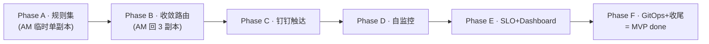

# 监控告警系统 · 阶段切分设计（Phase Breakdown Design）

> **文档定位**：把 `specs/prd.md` 的功能编号 **M1–M15** 切成 **6 个可独立验收的开发阶段（Phase A–F）** 的设计文档。
> 它是 `docs/14-监控告警系统开发任务拆分方案.md`（v0.6 执行框架）§3「基础参考草案」的**升格定稿**——
> 补全各 Phase plan 引用所需的字段（teardown 资源类型 / IaC-TDD 类型 / 降级规则 / plan 写作提示），
> 使每个 Phase 段自包含，能被 `docs/14` §6 提示词②（writing-plans）直接引用为上游输入。
>
> | 项 | 值 |
> |---|---|
> | 版本 | v1.0 |
> | 状态 | Draft（待用户审阅） |
> | 创建日期 | 2026-07-10 |
> | 上游依据 | `specs/prd.md` v1.0（WHAT/WHY/AC/M1–M15）· `specs/research/06-实际部署决策.md`（技术基线权威）· `docs/14-监控告警系统开发任务拆分方案.md` v0.6（执行框架） |
> | 读者/用途 | 各 Phase 的 writing-plans（`docs/14` §6 提示词②）；每个 Phase 段被 plan 直接引用 |

> **M 编号厘清**：PRD 有两套 M 编号——§5.1 的 **M1–M15 = 功能编号**（M1 基座部署 / M2 规则集 / M3 收敛路由 / M4 钉钉触达 / M5 自包含策略 / M6 自监控 / M7 severity 分级 / M8 SLO / M9 邮件兜底 / M10 Dashboard / M11 GitOps / M12 Ingress / M13 SmsProvider / M14 Runbook+手册 / M15 验收脚本）；§14 的 M1–M6 = 项目里程碑。**本文一律用 §5.1 的功能编号**。

> **切分不重开**：6 阶段切分已在 `docs/14` §7.2 取舍 3 认可；本设计沿用并定稿，不重开切分方案。技术基线以 `specs/research/06` 为权威，不重开选型。

---

## 0. 文档定位与读者

- 本设计**只承载「阶段切分本体」**——每个 Phase 的范围、目标、验收门、AC 映射、前置 OQ、teardown 资源类型、IaC-TDD 类型、降级规则、plan 写作提示。
- **不重复方法论**：双轨验收 6 步闭环、5 个提示词链、OQ 总表与 MVP 处理策略、IaC-TDD 三类（L0/L1/L2）定义、teardown 三类资源规则的定义 —— 均在 `docs/14`，本文**交叉引用、不重抄**。
- **唯一受控偏离**：Phase A 的 Alertmanager 临时单副本偏离 06 §3.2「必须 3 副本」，Phase B 强制回收（见 §6 判断 1）。
- 冲突时以 `specs/research/06` 为准；本设计不引入新决策（对齐 `docs/14` §8）。

---

## 1. 切分原则

1. **按监控告警链路的可验收段切**，不按 M 编号切（`docs/14` §2）：
   `采集(scrape · 已有) → 规则(PrometheusRule) → 收敛(Alertmanager) → 触达(钉钉) → 自监控(Watchdog)`
2. **每 Phase = 一个 plan + 一个可观测验收门**（对应 PRD 某条 AC）+ 双轨验收闭环（`docs/14` §3.3）。每个 Phase 不是「agent 跑通就算完」，而是 agent 预演探路 + 用户手动复现通过才算阶段完成。
3. **MVP done = kind 3 节点验收门（A 档）**；生产割接是 MVP 之后的独立里程碑，不阻塞验收（PRD §2.4）。本设计所有验收门均在 kind `k8s-monitor-dev` 上可复现。
4. **执行链全串行 `A→B→C→D→E→F`**：同一 kind 集群 + 每阶段需用户手动复现，物理（同集群非两套环境）与人工（一次复现一个 Phase）都只能串行（`docs/14` §3.3「同集群串行」铁律）。
   - **唯一可重叠点**：下游 Phase 的「写 plan（闭环①）」是纯文档、不动集群，可与上游 Phase 的预演+复现同步进行；闭环 ②③④⑤（预演执行 / 手册 / teardown / 用户复现）严格串行，预演依然按 Phase 排队进集群。
   - `docs/14` §3.2「第 3 周 = C+D」是**人天排期估算，非执行并行**——执行上 C 完成（含用户复现）后才进 D。

---

## 2. 阶段总览

| Phase | 范围 (M) | 一句话目标 | 主验收 AC | 关键 OQ 依赖 |
|---|---|---|---|---|
| **A · 告警规则集** | M2（＋M1 AM 启用·M15 verify 增项·`inject-fault.sh` 框架） | 打通「规则→评估→firing 可见」 | AC-US1 前半（触发） | — |
| **B · 收敛与路由** | M3, M7 | AM 升 3 副本 quorum + 收敛 / 分流 / inhibit | AC-US2 / AC-US5 / AC-NFR-02 | OQ-3, OQ-8 |
| **C · 钉钉触达** | M4, M5, M14a | 钉钉 ActionCard 送达 + MTTD 测量骨架 | 链路送达（AC-US1/US3/NFR-01 完整推迟 F） | OQ-5, OQ-6, OQ-7 |
| **D · Meta-monitoring** | M6, M9 | 8 条自监控 + Watchdog 独立群 + Email 兜底 | AC-US4 | OQ-6, OQ-9 |
| **E · SLO + Dashboard** | M8, M10 | 4 个 SLI + Grafana 本地化 | 无硬 AC（支撑性） | — |
| **F · GitOps + 收尾** | M11, M13, M14b, M15 | GitOps + 全量演练 + 全部 AC 闭环 | **全部 9 条 AC（MVP done）** | OQ-1, OQ-7 |

**依赖链（全串行）**：

> 闭环①「写下一 Phase 的 plan」可与上一 Phase 的 ②~⑤ 重叠（纯文档不动集群），但图中不画虚线，以免误读为执行并行。

---

## 3. 各阶段详设（Phase A–F，每段 8 字段自包含）

> 字段说明：① 范围(M) ② 目标与交付物 ③ 验收门（agent 预演技术门 + 对应 PRD AC） ④ 前置 OQ 与依赖 ⑤ teardown 资源类型（新建/修改/凭据，规则见 `docs/14` §3.3） ⑥ IaC-TDD 适配类型（L0/L1/L2，定义见 `docs/14` §5） ⑦ 降级规则（若有） ⑧ plan 写作提示。

### Phase A · 告警规则集（`docs/14` §3）

- **① 范围 (M)**：**M2**（核心告警规则集）＋ M1 的 AM 启用为**临时单副本** ＋ M15 的 verify-all 增项 ＋ 故障注入框架 `inject-fault.sh`。横切：M1 调优（AM 资源配额随启用带入）。
- **② 目标与交付**：打通「规则→评估→firing 可见」链路。交付 `PrometheusRule`（10–15 条核心规则：节点/Pod/工作负载/容量/控制面）＋ Alertmanager 单副本 ＋ verify-all 规则评估检查 ＋ `inject-fault.sh`（预留 NotReady / CrashLoop / OOM / PodPending / 控制面 5 类接口 ＋ `cleanup` 子命令）。
- **③ 验收门**：agent 预演技术门 = 对一 worker 节点 `docker exec <node> pkill -STOP kubelet` 暂停心跳（~40s 后 NotReady）持续 5m → `KubeWorkerNodeNotReady` 在 Alertmanager **firing 可见**（⚠️ 不用 cordon——cordon 只设 `unschedulable`、不改 `Ready`，预演实测勘误，见 PRD AC-US1-01 注 / 手册 §4-T5）。对应 PRD = **AC-US1 的前半段**（触发成功）；完整 AC-US1（ActionCard 送达 + MTTD≤6min）显式推迟 Phase C/F。
- **④ 前置 OQ / 依赖**：**无 hard blocker**（AM 单副本不依赖排班）。前置 = M1 基座已就绪（已核查：`alertmanager.enabled:false`、无任何 PrometheusRule/AlertmanagerConfig/dingtalk 配置）。OQ-8（kind HA 限制）边界声明留 Phase B。
- **⑤ teardown 资源类型**：**新建型**——`PrometheusRule` CRD `kubectl delete`、`inject-fault.sh` 测试 Pod `delete`；**修改型**——AM 启用改了 kps values，teardown = `helm upgrade -f` 回 `alertmanager.enabled:false` 的 M1 基座态；凭据型：无。
- **⑥ IaC-TDD 类型**：**L0**（verify-all 规则评估检查：可 RED-first，先写检查必 FAIL→实现→PASS）＋ **L1**（firing 是行为契约：先写「注入 NotReady→查 AM API 有 firing」断言脚本再配规则；`for:5m` 时序敏感，红绿可能模糊）。
- **⑦ 降级规则**：无（5m `for` 是正常评估窗口，非长耗时）。
- **⑧ plan 写作提示**：(a) 显式声明「AM 单副本是临时偏离，Phase B 必须回收 3 副本」；(b) `inject-fault.sh` 接口设计成可扩展（C/D/F 复用），5 类注入＋`cleanup`；(c) 每 task 记「改了哪些资源＋改前值」（teardown 修改型回滚要用）；(d) **若 plan >400 行**，把规则裁剪拆为子段 **Phase A.5**——A.5 承载控制面补充 / KSM / 容量趋势类规则，A 保留节点·Pod·工作负载核心（判定口子，不预先拆死）。

### Phase B · 收敛与路由（`docs/14` §3）

- **① 范围 (M)**：**M3**（收敛与路由）＋ **M7**（severity 四级分流）。横切：无。
- **② 目标与交付**：Alertmanager 升 **3 副本 quorum ＋ PDB minAvailable:2 ＋ 反亲和**（回收 06 §3.2 基线）；route tree（`group_by` / `group_wait` / `repeat_interval` / `inhibit_rules`）；severity 四级（critical/warning/info/none → P0–P3）分流 receiver。**首 task 建 `oncall` ConfigMap**（OQ-3 配置驱动占位值）。
- **③ 验收门**：agent 预演技术门 = **AC-US2**（多 Pod 副本不足收敛成一条，非 N 条）＋ **AC-US5**（节点 NotReady 时 inhibit 抑制其 Pod 症状）＋ **AC-NFR-02**（风暴注入后收敛率显著 <1:1，需设计可复现风暴：batch 起 N 个 CrashLoop Pod）。对应 PRD = AC-US2 / AC-US5 / AC-NFR-02 **完整在此验**。
- **④ 前置 OQ / 依赖**：**OQ-3** 值班人（hard blocker → MVP 用 oncall ConfigMap 占位值策略，`docs/14` §7.1.1）；**OQ-8** kind 3 节点 HA 限制 → Phase B 的 HA 验收**仅验**拓扑分布合法 ＋ PDB 生效 ＋ 停一 Pod 后 quorum 仍成立（2<3），**不验网络分区/脑裂**（留生产割接）。
- **⑤ teardown 资源类型**：**修改型**——AM 单副本→3 副本，teardown = `helm upgrade -f values-phase-A.yaml` 回 A 态；route tree 改了 AM config → 回 A 态；**凭据型**——`oncall` ConfigMap 跨 Phase 共享（C 只读渲染 @人）→ **保留不删**（沿用 `docs/14` §3.3，不进 Git，手动注入）。
- **⑥ IaC-TDD 类型**：**L1**（AC-US2 收敛、AC-NFR-02 风暴：多数可 RED，先写「注入 N 个 CrashLoop→查 AM API 送达条数<N」断言再配 route）＋ **L1 时序敏感**（AC-US5 inhibit：需 NotReady `for:5m`＋CrashLoop `for:10m` 同时 firing 再查 inhibited，红绿模糊 → 标**集成测试、非确定红绿**，不强求 RED-first）。
- **⑦ 降级规则**：**集成测试类**（AC-US5 inhibit：synthetic 闸秒级确定 = **用户复现级**；`--real` 全链路 ~17m 非确定红绿 = **agent 预演级**；用户复现只验 synthetic 闸，见 `docs/14` §3.3 + phase-B 手册 §3.4）。收敛/风暴注入（AC-US2/AC-NFR-02）分钟级完成、无需降级。
- **⑧ plan 写作提示**：(a) 首任务 = **AM 升 3 副本**（硬回收点）＋建 oncall ConfigMap；(b) HA 验收边界**显式声明不验脑裂**（`docs/14` §3.1 判断 3）；(c) 风暴注入给出 batch 起 N 个 CrashLoop Pod 的可复现方法；(d) inhibit（AC-US5）标集成测试；(e) **AM route 一次配齐 main＋watchdog 两个 receiver**（watchdog receiver 在 D 才挂真实群，定义提前到位，避免 D 第三次改 AM config，`docs/14` §7.1.1 OQ-6）。

### Phase C · 钉钉触达（`docs/14` §3）

- **① 范围 (M)**：**M4**（钉钉触达）＋ **M5**（自包含策略）＋ **M14a**（Runbook 公网托管骨架）。横切：M12 Ingress 在 C 几乎不接入（webhook-dingtalk 是集群内 svc，不走 Ingress）；Grafana 内网链接仅消息体字段（可 stub），M12 主要留 Phase E。
- **② 目标与交付**：prometheus-webhook-dingtalk 部署 ＋ 加签 Secret ＋ Markdown(默认)/ActionCard(P0/P1) 模板 ＋ 自包含策略（kubectl 命令 ＋ Runbook 链接字段 ＋ 责任人 @）＋ **MTTD 测量骨架**（T0 注入时间戳→T_detect 卡片到达）＋ **M14a** Runbook URL 字段在位（内容可 stub）。
- **③ 验收门**：agent 预演技术门 = **链路送达**：ActionCard 到达钉钉测试群，含可执行 kubectl ＋ 责任人 @（读 oncall ConfigMap）＋ Runbook 链接字段在位（URL 可 stub）＋ MTTD 测量链路打通（单次 T0→T_detect）。⚠️ 完整 **AC-US1 / AC-US3 / AC-NFR-01（统计达标）显式推迟 Phase F**。
- **④ 前置 OQ / 依赖**：**OQ-5** T0 埋点（hard blocker → MVP：`inject-fault.sh` 注入时记 T0 到日志，`docs/14` §7.1.1）；**OQ-6** 主告警群（hard blocker → 预演前维护者建钉钉测试群＋机器人）；OQ-7 Runbook 托管位置（M14a URL 可 stub，不阻塞）；OQ-3 @人 → 读 B 的 oncall ConfigMap（已衔接）。**前置凭据**：钉钉测试群＋机器人 webhook＋加签 secret（闭环⓪ 检查）。
- **⑤ teardown 资源类型**：**新建型**——webhook-dingtalk Deployment `helm uninstall`、MTTD 测量脚本/Job `delete`；**修改型**——AM route 在 B 已配 main＋watchdog receiver，C 把 main receiver 挂真实 endpoint → teardown = apply 回 B 态 receiver 配置；**凭据型**——钉钉加签 Secret、oncall ConfigMap **保留不删**。
- **⑥ IaC-TDD 类型**：**L1**（链路送达：先写「注入 NotReady→查测试群收到 ActionCard」断言再部署 webhook；但「查钉钉群」非确定性 API 断言，红绿半模糊）＋ **L2**（MTTD 测量：不适用 RED，骨架先建）。
- **⑦ 降级规则**：无（单次链路送达分钟级；MTTD 单次测量非长耗时）。
- **⑧ plan 写作提示**：(a) 预演前维护者建测试群＋机器人（闭环⓪）；(b) @人 读 oncall ConfigMap 不改；(c) main＋watchdog receiver 在 B 已配齐，C 只挂 main 真实 endpoint，避免第三次改 AM config；(d) M14a 只验「URL 字段在位」，真实公网 URL 留 M14b(F)；(e) MTTD 骨架 = T0 写日志 ＋ T_detect 卡片到达，单次打通，统计留 F；(f) 加签 / 限流(20 条·分) / 截断(3500–4000 字符) 坑写进手册。

### Phase D · Meta-monitoring（`docs/14` §3）

- **① 范围 (M)**：**M6**（Meta-monitoring 第 1 层）＋ **M9**（邮件兜底）。横切：无。
- **② 目标与交付**：8 条自监控规则（Watchdog / PrometheusDown / AlertmanagerDown / GrafanaDown / DingtalkWebhookDown / NotificationFailure / RuleEvaluationFailure / MonitoringDiskFull）＋ Watchdog 1h 心跳发**独立「监控健康」钉钉群** ＋ Alertmanager 原生 Email（SMTP STARTTLS 587）兜底。
- **③ 验收门**：agent 预演技术门 = **AC-US4**（人为停一个 Alertmanager / Prometheus / webhook 副本 → 对应自监控规则在 `for` 时限内触发 critical）＋ Watchdog 持续每 1h 更新独立群。对应 PRD = **AC-US4 完整在此验**。
- **④ 前置 OQ / 依赖**：**OQ-6** 监控健康独立群（hard blocker → 预演前维护者建第 2 个钉钉群＋机器人；watchdog receiver 在 B 已配定义，D 挂真实群）；**OQ-9** SMTP 策略（hard blocker for M9 → 需 IT 确认 Exchange MFA / 应用密码；**MVP 降级**：IT 未就绪则 Email receiver 先 stub 验路由，真实发信留生产前）。前置凭据：监控健康群＋机器人（闭环⓪）；SMTP 凭据（若 M9 实做）。
- **⑤ teardown 资源类型**：**新建型**——8 条自监控规则用**独立 PrometheusRule CR**（如 `monitoring-self-rules`，teardown = `delete` 该 CR，不污染 A 的规则集）＋ verify-all 自监控检查项；**修改型**——AM route 把 watchdog receiver 挂真实独立群 endpoint → teardown = apply 回 C 态；Email receiver 加 → 回前序；**凭据型**——SMTP Secret、监控健康群机器人 secret **保留不删**。
- **⑥ IaC-TDD 类型**：**L1**（AC-US4 停副本被发现：先写「停一 AM 副本→查 AlertmanagerDown firing」断言再配规则，`for:2m` 时序可控）＋ **L0**（自监控规则评估检查可加 verify-all）。
- **⑦ 降级规则**：**有**——Watchdog 1h 心跳：agent 预演练完整周期（≥2h 确认 2 条），**用户复现只验「第 1 条心跳 1h 内到达」**（`docs/14` §3.3 长耗时降级）。
- **⑧ plan 写作提示**：(a) 自监控规则用独立 PrometheusRule CR（teardown 干净）；(b) Watchdog **必须发独立群、不发主告警群**（06 §3.10.2 强制）；(c) watchdog receiver 在 B 配定义、C 未挂真实，D 才挂真实监控健康群（不重复改 AM config）；(d) AC-US4 用 `inject-fault.sh`（A 建的）停副本；(e) SMTP 未就绪则 M9 先 stub（OQ-9 降级）；(f) Watchdog 用户复现按降级只验第 1 条心跳。

### Phase E · SLO + Dashboard（`docs/14` §3）

- **① 范围 (M)**：**M8**（简化版 SLO）＋ **M10**（Dashboard 本地化）。横切：**M12 Ingress**（Grafana 域名在 E 重度接入）。
- **② 目标与交付**：4 个资源 SLI recording rules（节点 Ready 率 / Pod Ready 率 / API Server 可用性 / Prometheus 在线率）＋ 目标值 ＋ Grafana 中文化（cluster label / namespace 选择器 / `execute_alerts:false`）。
- **③ 验收门**：agent 预演技术门 = SLI recording rules **有数据** ＋ Grafana 集群总览 Dashboard **可读**。对应 PRD = **无直接 AC**——E 是支撑性阶段（SLO 是内部健康度参考，PRD §6.7「非对外承诺」；Dashboard 是总览层）。验收门是「有数据＋可读」，非某条 AC。
- **④ 前置 OQ / 依赖**：**无 hard blocker**。横切 M12 Ingress（Grafana 域名）在 E 接入。
- **⑤ teardown 资源类型**：**新建型**——4 个 SLI recording rules 用独立 PrometheusRule CR → `delete`；Grafana Dashboard ConfigMap → `delete`；**修改型**——Grafana values 中文化改 → `helm upgrade -f` 回前序；`execute_alerts:false` 若改 → 回前序；凭据型：无（Grafana admin 密码 kps 默认随机，属部署产物）。
- **⑥ IaC-TDD 类型**：**L0**（SLI rules 有数据：加 verify-all 检查「查 PromQL 有返回」）＋ **L1**（Dashboard 可读：先写「查 Grafana API dashboard 可返回」断言）。偏 L0 验证型。
- **⑦ 降级规则**：无。
- **⑧ plan 写作提示**：(a) SLI rules 用独立 PrometheusRule CR；(b) `execute_alerts:false` **强制约定**（规则评估始终由 Prometheus，PRD §8.3）；(c) M12 Ingress 在 E 接入 Grafana 域名（cluster label / namespace 选择器需 Ingress 可达才好验）；(d) SLO 目标值（节点 Ready≥96% 等）来自 PRD §6.7，是健康度参考非对外承诺；(e) Dashboard 复用 kps 内置不重写，只本地化。

### Phase F · GitOps + 收尾（`docs/14` §3）—— **MVP done 最终门**

- **① 范围 (M)**：**M11**（GitOps）＋ **M13**（SmsProvider NoOp 占位）＋ **M14b**（Runbook 真实内容＋值班手册＋全量演练）＋ **M15**（verify-all / recover 对齐 06 验收项）。横切：M12 Ingress 收尾（Alertmanager / ArgoCD 域名）。
- **② 目标与交付**：ArgoCD（PrometheusRule / AlertmanagerConfig **CRD 化** ＋ Application ＋ 手动 Helm/kubectl fallback）＋ 紧急操作脚本（AM API silence / kubectl edit CRD 事后补 PR）＋ SmsProvider NoOp（M13）＋ M14b Runbook 公网真实内容＋值班手册 ＋ **全量故障注入演练**（NotReady / CrashLoop / OOM / PodPending / 控制面 各 N 次取 MTTD 中位）＋ verify-all / baseline.txt 对齐 06。
- **③ 验收门**：agent 预演技术门 = **全部 9 条 AC 通过**（含推迟至此的完整 AC-US1 / AC-US3 / **AC-NFR-01 统计达标** / AC-NFR-02 / AC-NFR-03）＋ verify-all 全绿 ＋ recover.sh 能从挂机 / 节点 stop / Pod netns wedge 恢复。对应 PRD = **全部 AC 在此闭环**（前序验贯通，F 验统计达标＋全量）。这是 **MVP done 的最终验收门**。
- **④ 前置 OQ / 依赖**：**OQ-1** Git 仓库位置（hard blocker for M11 紧急 push 是否依赖 VPN）；OQ-7 Runbook 托管位置（M14b 真实公网 URL）；OQ-3 排班（M14b 值班手册）。其余 OQ 前序已闭环。
- **⑤ teardown 资源类型**：**新建型**——ArgoCD Application CR `delete`、SmsProvider NoOp Deployment `delete`；**修改型**——前序手动 apply 的规则若改成 ArgoCD 管理 → teardown = apply 回前序手动态；baseline.txt 改 → 回前序；凭据型——Git / ArgoCD repo secret 保留；**特殊**：F 是终态验收 Phase，**F 完成后集群 = MVP 完整态（M1+A~F 全在），不清回**；F 的 teardown 仅服务于「用户复现 F」前的还原。
- **⑥ IaC-TDD 类型**：**L0**（verify-all / baseline 对齐：RED-first 加检查项）＋ **L1**（ArgoCD sync：写「Application synced healthy」断言）＋ **L2 MTTD 全量统计**（AC-NFR-01 北极星：F 跑全量 N×5 取中位，非 RED）。
- **⑦ 降级规则**：**有**——Phase F MTTD 统计：agent 预演跑全量 N×5 取中位，**用户复现每类故障抽验 1 次**（链路通＋单次不爆表，`docs/14` §3.3）。
- **⑧ plan 写作提示**：(a) **GitOps 同步范围 = 纯部署产物**（PrometheusRule / AlertmanagerConfig / Application CR），**不含 oncall ConfigMap 和密钥 Secret**（手动注入——oncall 凭据型决定的边界）；(b) OQ-1 Git 位置必须闭环才能验 M11 紧急 push；(c) M14b 把 M14a 的 stub URL 换真实公网内容＋写值班手册；(d) 全量演练复用 A 的 `inject-fault.sh`（5 类）；(e) **AC-NFR-01 北极星在此统计达标**（C 只打通骨架）；(f) MTTD 用户复现按降级每类抽验 1 次；(g) SmsProvider NoOp 纯接口预留（二期接真实短信）；(h) F 是 MVP done 最终门：9 AC 闭环＋verify-all 全绿＋recover.sh 验证。

---

## 4. AC → Phase 验收映射总表

> 本表是 design 的增量（`docs/14` 没有，原散落在各 Phase）。让 plan 引用时一眼看清每条 AC 在哪验、验到什么程度。

| AC | 内容摘要 | 主验 Phase | 验收到什么程度 |
|---|---|---|---|
| **AC-US1-01** | NotReady→P1 ActionCard 送达 @值班，MTTD≤6min | A → C → **F** | A: firing 可见；C: ActionCard 到达＋@人＋Runbook 字段(URL stub)；**F: 完整 MTTD≤6min 统计＋真实公网 Runbook** |
| **AC-US2-01** | 收敛＋@人（同 namespace＋alertname 收敛成一条） | **B** | 完整验 |
| **AC-US3-01** | 自包含，VPN 不可达（kubectl＋公网 Runbook） | C → **F** | C: 消息体含 kubectl＋Runbook 字段(URL stub)；**F: 真实公网 URL 不依赖 Grafana** |
| **AC-US4-01** | Watchdog / 自监控（停副本被发现＋Watchdog 1h） | **D** | 完整验 |
| **AC-US5-01** | inhibit 抑制（节点 NotReady 抑制其 Pod 症状） | **B** | 完整验（集成测试，非确定红绿） |
| **AC-NFR-01** | 告警链路时延 MTTD≤for+1min，送达率 100%（北极星） | C → **F** | C: 单次链路打通；**F: 全量 N×5 取中位达标＋送达率 100%** |
| **AC-NFR-02** | 收敛率护栏（风暴收敛率<1:1） | **B** | 完整验 |
| **AC-NFR-03** | verify-all 全绿＋recover.sh 自愈 | A → **F** | A: 加规则评估检查；**F: 16 项全绿＋recover 挂机/netns 恢复** |

---

## 5. 横切项处理（M1 调优 / M12 Ingress，不单列 Phase）

| 横切项 | 内容 | 插入时机 |
|---|---|---|
| **M1 基础设施调优** | kps values 资源配额 / retention / Prometheus HA 等 | Phase A（AM 启用时带入 AM 资源配额）；持续微调贯穿 A~F（每个改 kps values 的 Phase 都涉及） |
| **M12 VPN 内网 Ingress** | Grafana / Alertmanager / ArgoCD 3 域名＋内网 IP 白名单 | Phase E（Grafana 域名，重度）；Phase F（Alertmanager / ArgoCD 域名，收尾）；Phase C 仅消息体内网链接字段（stub，不接入） |

> 横切项不单列 Phase，因其依赖各功能 Phase 的产物（域名指向具体服务）。M1 调优随 AM/Prometheus 启用自然带入；M12 Ingress 随对应服务域名需求插入。

---

## 6. 设计判断与受控偏离登记

| # | 判断 | 内容 | 依据 |
|---|---|---|---|
| 1 | **AM 两步走**（唯一受控偏离） | Phase A 开单副本（快速看第一条告警），Phase B 首 task 升回 3 副本 quorum（硬回收点） | 06 §3.2（2 副本脑裂双发）；`docs/14` §3.1 判断 1 / §7.2 取舍 1 |
| 2 | **北极星两级** | Phase C 打通测量链路（单次），Phase F 统计达标（N 次中位） | 北极星需 N 样本，C 时 Watchdog 未上线；`docs/14` §3.1 判断 2 |
| 3 | **kind HA 验收边界** | Phase B 仅验拓扑分布合法＋PDB 生效＋停一 Pod quorum 成立(2<3)，不验网络分区/脑裂（留生产） | kind 3 节点同 Docker 网络无法构造有意义的分区（OQ-8）；`docs/14` §3.1 判断 3 |
| 4 | **M14 拆分** | M14a（Runbook 公网托管骨架，URL 字段）前置 Phase C；M14b（真实内容＋值班手册＋演练）留 Phase F | 解除 Phase C 对 F 的反向依赖（AC-US1/US3 要公网 Runbook）；`docs/14` §3.1 判断 4 |

**唯一受控偏离声明**：Phase A 的 Alertmanager 临时单副本偏离 06 §3.2「必须 3 副本」，Phase B 强制回收（`docs/14` §8）。这是全方案唯一的基线偏离，其余严格遵循 06。

---

## 7. 与 `docs/14` / PRD / 06 的对齐

- 功能边界、AC、NFR、Non-Goals 来自 **PRD**；技术基线（组件 / 版本 / 拓扑）以 **06** 为权威，不重开选型。
- 切分沿用 **`docs/14` §3**（6 阶段已认可，`docs/14` §7.2 取舍 3）；本设计是其**升格定稿**，补全 plan 引用所需字段（teardown 类型 / TDD 类型 / 降级规则 / plan 提示）。
- 本设计**只承载阶段切分本体**；双轨验收 6 步闭环、5 个提示词、OQ 总表与处理策略、IaC-TDD 三类定义 —— 在 `docs/14`，**交叉引用不重复**。
- **本设计对 `docs/14` 的两处澄清**（不改变决策，只消歧）：
  1. **oncall ConfigMap 归凭据型、不进 Git**（沿用 `docs/14` §3.3 现状）→ 据此明确 **Phase F GitOps 同步范围不含 oncall ConfigMap 和密钥 Secret**（手动注入）。判别依据：凭据型 = 值是环境注入（非 Git 产物）；oncall 排班与密钥同属「环境数据」，与「部署产物（CRD）进 Git」分离。
  2. **`docs/14` §3.2「C+D 第 3 周」是排期估算，非执行并行** → 执行链**全串行**（§1 切分原则 4），仅「写 plan（闭环①）」可提前。
- 冲突时以 06 为准；本设计不引入新决策。

---

## 下一步

本设计（brainstorming 产物）完成后，按 `docs/14` §6 提示词链推进：

1. **每阶段一次**：用 `superpowers:writing-plans`（提示词②），输入 = 本设计的 Phase \<X\> 段 ＋ `specs/prd.md` 对应 AC ＋ `specs/research/06` 对应技术节（§3.x），产出 plan（纯部署 TDD，IaC 适配见 `docs/14` §5）。
2. plan 存 `docs/superpowers/plans/2026-07-10-phase-<X>-<name>.md`。
3. 之后按 `docs/14` §3.3 双轨 6 步闭环推进（预演 → 手册 → teardown → 用户复现）。

---

## 修订记录

- **v1.0 (2026-07-10)**：初版。基于 `superpowers:brainstorming` 把 `docs/14` v0.6 §3 的「基础参考草案」升格为独立、自洽、可被 plan 直接引用的定稿设计。沿用 6 阶段切分（不重开）；定调执行链全串行（仅写 plan 可提前）；oncall ConfigMap 归凭据型不进 Git；补全每 Phase 的 teardown 类型 / TDD 类型 / 降级规则 / plan 提示 4 个 plan 引用字段 ＋ AC→Phase 总表 ＋ 横切项插入时机 ＋ 设计判断登记。
