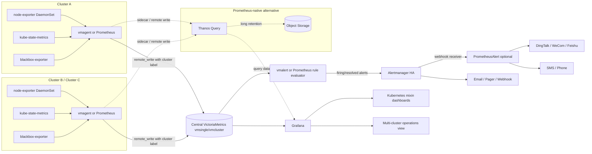

# 04-实现方案

## 1. 方案总览

推荐采用“每集群轻量采集 + 中心统一存储/查询 + Prometheus 兼容告警 + Alertmanager 路由 + Grafana 大盘”的实现路线：每个 K8s 集群部署 node-exporter、kube-state-metrics、blackbox-exporter，并用 Prometheus 或 vmagent 采集指标；中心侧优先使用 VictoriaMetrics（vmsingle 起步，生产高可用用 vmcluster）统一存储 1-3 个集群指标；告警规则保持 PrometheusRule/PromQL 兼容，由 Prometheus rule evaluator 或 vmalert 执行；通知侧以 Alertmanager 做去重、分组、抑制和路由，必要时通过 Webhook 接入 PrometheusAlert 以支持钉钉、企业微信、飞书、短信、电话等国内常见渠道；展示侧使用 Grafana + kubernetes-mixin / kube-prometheus-stack / VictoriaMetrics K8s Stack 自带 Dashboard。[双路 ✅]

该方案的核心原则是“不自研通用监控基础设施，只在责任人映射、告警模板、业务规则和部署编排上做少量定制”，因为 node-exporter、kube-state-metrics、Prometheus、Alertmanager、Grafana、blackbox-exporter 都已有成熟生态和标准化接入方式。[双路 ✅]

推荐落地顺序：先单集群跑通采集、存储、告警、通知和大盘，再扩展到 1-3 集群统一视图，最后补齐告警责任人路由、告警收敛、规则 GitOps、Dashboard 版本管理和监控系统自监控。[路B]

## 2. 数据采集层

### 2.1 主流方案对比

| 方案 | 实现方式 | 优点 | 缺点 | 工作量 |
|---|---|---|---|---|
| 方案 A：标准 Exporter 组合 | node-exporter 以 DaemonSet 部署到每个节点，kube-state-metrics 以 Deployment/StatefulSet 监听 K8s API 并暴露对象状态指标，blackbox-exporter 探测 HTTP/TCP/DNS/ICMP/gRPC 等外部可达性。[双路 ✅] | 生态成熟、Prometheus 兼容、Dashboard 和告警规则可直接复用 kubernetes-mixin / kube-prometheus-stack，node-exporter 与 kube-state-metrics 是 K8s 监控事实标准组件。[双路 ✅] | 高基数风险需要通过采集过滤、label 规范、scrape interval 和 recording rule 控制；ICMP 探测需要 Linux CAP_NET_RAW、root 或 ping_group_range 权限配置。[路A] | 8-12 人天 |
| 方案 B：Prometheus / vmagent 直接采集 Kubelet、APIServer、Exporter | 每集群部署 Prometheus 或 vmagent，通过 ServiceMonitor/PodMonitor/scrape_config 采集 kubelet/cAdvisor、node-exporter、kube-state-metrics、blackbox-exporter。[双路 ✅] | 保持 Prometheus 协议，后续可远程写入 VictoriaMetrics、Thanos Receive、Mimir/Cortex 等后端；vmagent 相比完整 Prometheus 更轻量，适合只采集后远程写入的场景。[路B] | 如果只用中心 Prometheus 跨集群拉取，网络、RBAC、服务发现和可用性会变复杂；如果每集群都保留完整 Prometheus，本地资源占用高于轻量 vmagent。[路B] | 6-10 人天 |
| 方案 C：自研 Agent | 自研 DaemonSet 采集节点、Pod、K8s API、网络探测并统一上报。[单源 ⚠️] | 可深度定制字段、协议和权限模型，适合已有自研可观测平台团队。[单源 ⚠️] | 需要重做 exporter、服务发现、采集限流、缓存、重试、指标格式、升级兼容和安全加固，维护成本远高于标准 Exporter 组合。[双路 ✅] | 25-40 人天起 |

### 2.2 kube-state-metrics 部署模式

kube-state-metrics 是一个监听 Kubernetes API Server 并生成 Kubernetes 对象状态指标的服务，关注 Deployment、Node、Pod 等对象状态，而不是单个组件健康状态。[路A]

kube-state-metrics 默认在 `/metrics` 暴露当前集群状态指标，并可被 Prometheus 或兼容 scraper 抓取。[路A]

kube-state-metrics 对 100 节点规模的官方资源建议为约 250MiB 内存和 0.1 CPU core，但对象数量、标签数量和更新频率会影响实际资源消耗。[路A]

kube-state-metrics 支持水平分片、Deployment 分片、StatefulSet 自动分片、Pod 指标按节点 DaemonSet 分片以及资源 allowlist/denylist 过滤；中型集群建议先单副本或双副本高可用部署，只有在 API 对象数量或延迟明显升高时再启用分片。[路A]

kube-state-metrics 提供 list/watch 成功和失败的自监控指标，可用于发现权限、API Server 或配置问题。[路A]

### 2.3 K8s API Watch vs Pull 轮询

K8s 对象状态采集推荐使用 kube-state-metrics 的 list/watch 模式，而不是自研定时 Pull 轮询 API Server，因为 kube-state-metrics 已处理对象缓存、指标生成、兼容性和自监控，并且其指标稳定性随 Kubernetes API 对象稳定性演进。[路A]

Pull 轮询 API Server 只适合少量低频管理类数据同步，不适合作为通用指标采集主路径，因为频繁轮询会增加 API Server 和 etcd 压力，也会带来分页、限流、缓存一致性和对象删除处理问题。[单源 ⚠️]

### 2.4 网络探测

blackbox-exporter 支持 HTTP、HTTPS、DNS、TCP、ICMP 和 gRPC 探测，并通过 `/probe?target=...&module=...` 返回 `probe_success` 和耗时等指标。[路A]

ICMP 探测在 Linux 上需要 CAP_NET_RAW、root 或 `net.ipv4.ping_group_range` 配置，因此生产部署时需要显式声明安全上下文和权限边界。[路A]

### 2.5 推荐与不用 X 的原因

推荐采用“node-exporter DaemonSet + kube-state-metrics Deployment + blackbox-exporter Deployment + Prometheus/vmagent scraper”的标准组合。[双路 ✅]

不推荐自研 Agent 作为一期主方案，因为标准 Exporter 已覆盖节点、K8s 对象状态和黑盒探测的大部分需求，自研会把工作量从 8-12 人天放大到 25-40 人天，并引入长期维护风险。[双路 ✅]

不推荐中心 Prometheus 直接跨集群拉取所有 exporter 作为主方案，因为跨集群网络、服务发现、证书、RBAC 和链路中断都会影响采集稳定性；更稳妥的方式是每集群本地采集后 remote_write 到中心存储。[路B]

## 3. 指标存储层

### 3.1 主流方案对比

| 方案 | 实现方式 | 优点 | 缺点 | 工作量 |
|---|---|---|---|---|
| 方案 A：Prometheus 本地 TSDB | 每集群部署 Prometheus，指标写入本地磁盘，保留 15-30 天，Grafana 直接查询或通过 Federation 汇总。[路A] | 简单、生态最成熟、规则和 Dashboard 兼容性最好；Prometheus 本地 TSDB 使用高效格式，平均每个样本约 1-2 字节。[路A] | 本地存储不支持集群化和复制，磁盘或节点故障会影响耐久性；官方明确本地存储不是任意可扩展或高可用的集群数据库。[路A] | 6-10 人天 |
| 方案 B：VictoriaMetrics 单机/集群 | 每集群用 vmagent 或 Prometheus remote_write 到中心 vmsingle；生产高可用或更长保留时升级 vmcluster。[双路 ✅] | Prometheus API 兼容，Grafana 接入简单；Route B 调研认为其 CPU、内存和存储效率优于 Prometheus + Thanos/Cortex，适合 10-100 节点、1-3 集群的中型场景。[路B] | 高可用 vmcluster 需要理解 vminsert、vmselect、vmstorage 和复制/分片；性能优势属于 Route B 调研结论，未在本轮 Route A 官方页面中独立量化确认。[单源 ⚠️] | 10-15 人天 |
| 方案 C：Thanos / Cortex / Mimir | 每集群 Prometheus 加 sidecar 或 remote_write，中心 Query 聚合，长周期数据进对象存储或分布式后端。[双路 ✅] | Thanos Query 可统一多集群视图，kubernetes-mixin 支持基于 external_labels / cluster label 的多集群 Dashboard。[路A] | 组件多，涉及对象存储、sidecar、store gateway、query、compactor、receiver 等，1-3 个中型集群的一期复杂度偏高。[路B] | 15-25 人天 |

### 3.2 100 节点集群每日数据量估算

Prometheus 官方容量公式为 `needed_disk_space = retention_time_seconds * ingested_samples_per_second * bytes_per_sample`，并给出平均每样本约 1-2 字节的粗略估算。[路A]

按工程经验假设 100 节点集群启用 node-exporter、kubelet/cAdvisor、kube-state-metrics 和少量业务探针后约有 150k-300k 活跃时间序列，该活跃序列数属于本方案估算参数而非官方固定值。[单源 ⚠️]

若 scrape interval 为 30 秒，150k-300k 活跃序列约等于 5k-10k samples/s，Prometheus 压缩后每日数据约 0.43-1.73GiB，考虑 WAL、索引、高基数、标签变更和增长冗余后建议按 2-4GiB/日/集群规划。[路A]

若 scrape interval 为 15 秒，150k-300k 活跃序列约等于 10k-20k samples/s，Prometheus 压缩后每日数据约 0.86-3.46GiB，考虑 WAL、索引、高基数和冗余后建议按 4-8GiB/日/集群规划。[路A]

Prometheus 默认保留时间为 15 天，生产建议同时设置 `storage.tsdb.retention.time` 和 `storage.tsdb.retention.size`，并把 retention.size 控制在磁盘容量的 80-85% 以内以留出安全缓冲。[路A]

推荐容量基线：单 100 节点集群按 30 天保留预留 150-300GiB 可用存储，3 个集群集中存储按 450-900GiB 起步，并根据真实 samples/s、series churn 和查询压力在上线后 1-2 周复盘扩容。[路A]

### 3.3 数据保留策略

P0/P1 告警和 SLO 指标建议保留 90 天以上，节点/Pod 明细指标建议保留 15-30 天，长期容量趋势可通过 recording rule 降采样后保留 180 天以上。[单源 ⚠️]

Prometheus 本地存储适合短周期保留和单集群快速落地，VictoriaMetrics 或 Thanos 适合多集群统一视图和更长保留。[双路 ✅]

### 3.4 推荐与不用 X 的原因

推荐一期优先使用 VictoriaMetrics vmsingle 或小型 vmcluster 作为中心存储，所有集群本地 vmagent/Prometheus remote_write 到中心，Grafana 查询中心 Prometheus API。[双路 ✅]

如果团队强依赖 Prometheus 原生生态和对象存储归档，可选择“每集群 Prometheus + Thanos sidecar + Thanos Query”的替代方案。[双路 ✅]

不推荐仅依赖每集群 Prometheus 本地盘作为最终方案，因为 Prometheus 本地存储没有复制和集群化能力，跨集群统一查询、长期保留和故障耐久性都需要额外组件支持。[路A]

不推荐 Cortex/Mimir 作为一期主方案，因为 1-3 个中型集群通常不需要完整多租户超大规模指标平台的复杂度。[路B]

## 4. 告警规则引擎

### 4.1 主流方案对比

| 方案 | 实现方式 | 优点 | 缺点 | 工作量 |
|---|---|---|---|---|
| 方案 A：Prometheus 原生 AlertingRule / PrometheusRule | 使用 Prometheus 或 Prometheus Operator CRD 加载 PromQL 规则，触发后发送到 Alertmanager。[双路 ✅] | 生态最成熟，kubernetes-mixin 已提供 Kubernetes 标准告警和 recording rules，PrometheusRule 可 GitOps 管理。[路A] | 多集群时每集群规则重复部署，中心统一规则需要额外设计；Prometheus 本地存储故障会影响规则评估。[路A] | 6-10 人天 |
| 方案 B：VictoriaMetrics vmalert | 规则仍写 PromQL/MetricsQL，vmalert 查询 VictoriaMetrics 并把告警发给 Alertmanager。[路B] | 适合中心 VictoriaMetrics 存储，能集中评估多集群规则，保持 Alertmanager 通知链路不变。[路B] | MetricsQL 扩展能力需要团队熟悉；若规则完全按 Prometheus 语义编写，需要避免使用后端特有函数导致迁移困难。[单源 ⚠️] | 6-10 人天 |
| 方案 C：Grafana Alerting / 自研外部引擎 | 由 Grafana 或自研服务查询指标并生成告警。[单源 ⚠️] | Grafana UI 配置友好，自研可做复杂业务策略、动态阈值和审批流。[单源 ⚠️] | 容易与 PrometheusRule 形成双规则源，审计、测试、GitOps 和抑制分组语义更复杂；自研外部引擎会重复实现规则调度、状态机和通知重试。[双路 ✅] | Grafana 8-12 人天；自研 25+ 人天 |

### 4.2 CrashLoopBackOff 标准规则

推荐的一期 CrashLoopBackOff 规则如下，基于 kube-state-metrics 暴露的容器等待原因指标并对 5 分钟窗口取最大值，避免瞬时抖动误报。[单源 ⚠️]

```yaml
groups:
  - name: kubernetes-workload.rules
    rules:
      - alert: KubePodCrashLooping
        expr: max_over_time(kube_pod_container_status_waiting_reason{reason="CrashLoopBackOff"}[5m]) >= 1
        for: 10m
        labels:
          severity: warning
        annotations:
          summary: "Pod {{ $labels.namespace }}/{{ $labels.pod }} container {{ $labels.container }} is crash looping"
          description: "Container is in CrashLoopBackOff for more than 10 minutes."
```

kubernetes-mixin 提供 Kubernetes Prometheus alerts 和 Grafana dashboards，并支持对 alert annotations 做自定义扩展，因此建议优先从 kubernetes-mixin 或 kube-prometheus-stack 的规则集裁剪，而不是从零写全套 K8s 告警。[路A]

### 4.3 动态阈值 vs 静态阈值

一期建议以静态阈值和明确事件类规则为主，例如 CrashLoopBackOff、PodNotReady、NodeNotReady、磁盘容量不足、API Server 请求错误率等，因为这些规则可解释、可测试、可 GitOps 审计。[双路 ✅]

动态阈值适合容量趋势、业务 QPS 异常和延迟异常，但需要历史基线、降噪、节假日/发布窗口处理和误报反馈闭环，因此不建议作为基础设施告警一期主路径。[单源 ⚠️]

### 4.4 告警抑制/分组最佳实践

Alertmanager 负责接收 Prometheus 等客户端发送的告警，并执行去重、分组、路由、静默和抑制。[双路 ✅]

推荐基础分组为 `group_by: [cluster, namespace, alertname, service]`，`group_wait: 30s`，`group_interval: 5m`，`repeat_interval: 2h-4h`，用于把同一集群、同一命名空间、同一服务的同类告警合并发送。[路B]

推荐抑制规则为“critical 抑制 warning，同一 cluster/namespace/service 下 NodeDown 或 ClusterUnavailable 抑制 Pod 级别症状告警”，以减少根因已知时的告警风暴。[路B]

### 4.5 推荐与不用 X 的原因

推荐保持规则源为 PrometheusRule 兼容格式，并根据存储选择 Prometheus 原生 evaluator 或 vmalert 执行；这样可复用 kubernetes-mixin、Prometheus Operator、Alertmanager 和 Grafana 生态。[双路 ✅]

不推荐一期自研告警引擎，因为规则状态机、for 持续时间、恢复通知、分组去重和抑制都是成熟系统已经解决的问题，自研会显著增加实现和运维风险。[双路 ✅]

## 5. 通知网关

### 5.1 主流方案对比

| 方案 | 实现方式 | 优点 | 缺点 | 工作量 |
|---|---|---|---|---|
| 方案 A：Alertmanager 原生通知 | Prometheus/vmalert 发送告警到 Alertmanager，Alertmanager 做 dedup、grouping、routing、silence、inhibition，并发送到 Email、Webhook、Slack、PagerDuty 等接收器。[双路 ✅] | 语义标准、与 Prometheus 生态原生集成、支持 HA、支持路由树和抑制，适合作为唯一告警收敛入口。[双路 ✅] | 国内 IM 渠道、短信、电话、模板测试和告警历史能力需要 Webhook 适配或二次系统支持。[路A] | 5-8 人天 |
| 方案 B：Alertmanager + PrometheusAlert | Alertmanager 仍做收敛和路由，Webhook receiver 转发到 PrometheusAlert，PrometheusAlert 负责钉钉、企业微信、飞书、短信、电话、邮件、Kafka 等渠道模板和发送。[路A] | PrometheusAlert 支持多种国内常见告警渠道，提供模板、测试、告警路由、告警历史、告警组和随机轮询等能力。[路A] | 多一层网关需要维护高可用、数据库、模板版本和失败重试；PrometheusAlert 能力主要来自项目 README，本轮未找到 Route B 独立验证来源。[单源 ⚠️] | 8-14 人天 |
| 方案 C：自研通知网关 | 自研 Webhook 服务接收 Alertmanager 告警，实现责任人映射、收敛、模板、渠道发送和历史记录。[单源 ⚠️] | 可对接内部通讯录、CMDB、值班系统和审批流程，能满足强定制组织结构。[单源 ⚠️] | 需要实现告警指纹、去重、合并、重试、渠道限流、模板渲染、审计、权限和高可用，容易重复 Alertmanager/PrometheusAlert 的能力。[双路 ✅] | 20-35 人天 |

### 5.2 按 namespace/服务责任人路由

推荐在 Kubernetes namespace、Deployment、Service 或 Helm values 中维护 `team`、`owner`、`service`、`severity` 等标签，并通过 kube-state-metrics 标签指标、Prometheus relabel/rule label 或规则 annotations 把责任人信息带入告警。[路A]

Alertmanager 路由树可按 `cluster`、`namespace`、`service`、`team`、`severity` 等 label matcher 分流到不同 receiver，因此 owner routing 不需要自研完整通知系统。[双路 ✅]

若责任人来自 CMDB 或通讯录，建议一期每日同步成 ConfigMap/Secret/values 并生成 Alertmanager route 或 PrometheusAlert 路由配置，二期再考虑在线配置界面。[单源 ⚠️]

### 5.3 告警收敛实现方式

Alertmanager 的 `group_by`、`group_wait`、`group_interval` 和 `repeat_interval` 可实现同类告警 N 分钟内合并、首次等待、组内新增告警再通知和周期性重复提醒。[双路 ✅]

推荐默认收敛策略：`group_by: [cluster, namespace, alertname, service]`，`group_wait: 30s`，`group_interval: 5m`，`repeat_interval: 4h`；P0 告警可缩短 group_wait，低优先级告警可延长 repeat_interval。[路B]

### 5.4 推荐与不用 X 的原因

推荐“Alertmanager 为唯一收敛入口 + Webhook 接 PrometheusAlert 处理国内渠道”的组合。[双路 ✅]

不推荐让 PrometheusAlert 替代 Alertmanager 做全部收敛，因为 Alertmanager 原生负责 dedup、grouping、routing、silence 和 inhibition，是 Prometheus 告警链路标准组件。[双路 ✅]

不推荐一期自研通知网关，因为告警去重、限流、模板、重试和多渠道适配会显著拉长交付周期；只有在必须深度对接内部 CMDB、值班系统和审批流时才做二期自研增强。[双路 ✅]

## 6. 多集群管理

### 6.1 主流方案对比

| 方案 | 实现方式 | 优点 | 缺点 | 工作量 |
|---|---|---|---|---|
| 方案 A：每集群独立 Prometheus + Grafana 数据源 | 每个集群独立安装 kube-prometheus-stack，Grafana 配多个数据源或多套 Grafana。[路A] | 落地最快，集群隔离强，单集群故障不会影响其他集群采集。[路A] | 无天然统一查询和统一告警视图，跨集群 Dashboard、容量趋势和告警去重需要额外配置。[双路 ✅] | 6-10 人天 |
| 方案 B：每集群采集 + 中心 VictoriaMetrics | 每集群 Prometheus/vmagent remote_write 到中心 vmsingle/vmcluster，中心 Grafana 和 vmalert 统一查询与告警。[双路 ✅] | 组件相对少，Prometheus API 兼容，适合 1-3 个中型集群统一视图；Route B 认为它比 Prometheus + Thanos 运维成本更低。[路B] | 中心存储成为关键组件，需要做 HA、备份、容量规划和 remote_write 队列监控。[路B] | 8-12 人天 |
| 方案 C：每集群 Prometheus + Thanos Query | 每集群 Prometheus 加 external_labels 和 Thanos sidecar，中心 Thanos Query 聚合多集群，长期数据进入对象存储。[双路 ✅] | Thanos Query 是 Prometheus 多集群统一查询的成熟方案，kubernetes-mixin 支持基于 external_labels/cluster label 的多集群 Dashboard。[路A] | 组件较多，对象存储、sidecar、store、query、compactor 都需要部署和监控；对 1-3 集群一期略重。[路B] | 15-25 人天 |

### 6.2 每集群独立 Prometheus vs 中心化采集

每集群独立 Prometheus 适合快速上线和强隔离，但多集群统一视图、统一告警和长期保留需要 Thanos、Cortex/Mimir 或 remote_write 后端补足。[双路 ✅]

中心 Prometheus 直接跨集群 Pull 所有目标不推荐作为主方案，因为跨集群网络中断会直接导致采集失败，且服务发现、证书、RBAC 和 API Server 访问链路更复杂。[路B]

“每集群本地采集，中心统一存储/查询”是 1-3 个中型集群更均衡的方案，因为它兼顾本地发现、网络容错和中心统一视图。[双路 ✅]

### 6.3 推荐与不用 X 的原因

推荐采用“每集群 vmagent/Prometheus + external_label cluster + 中心 VictoriaMetrics + Grafana 统一视图”，并保留切换到 Thanos 的 Prometheus 兼容规则和 label 设计。[双路 ✅]

如果组织已有对象存储、Prometheus Operator 和 Thanos 运维经验，可选择 Thanos Query 作为统一视图方案。[双路 ✅]

不推荐一期使用 Cortex/Mimir 或完全中心化 Pull，因为前者复杂度偏高，后者在跨集群网络、权限和可用性上风险更大。[路B]

## 7. 运维大盘

### 7.1 主流方案对比

| 方案 | 实现方式 | 优点 | 缺点 | 工作量 |
|---|---|---|---|---|
| 方案 A：Grafana + kubernetes-mixin | 使用 kubernetes-mixin 生成 Grafana dashboards、Prometheus alerts 和 recording rules，并按集群 label 开启多集群 Dashboard。[路A] | kubernetes-mixin 明确提供 Kubernetes Grafana dashboards 和 Prometheus alerts，且支持 multiCluster 配置和 clusterLabel。[路A] | Jsonnet 生成链路有学习成本，Dashboard 与指标 job label 需要按实际 scrape job 定制 selector。[路A] | 6-10 人天 |
| 方案 B：kube-prometheus-stack / VictoriaMetrics K8s Stack 自带 Grafana | Helm 安装全家桶，Grafana、Dashboard、Exporter、规则和 Alertmanager 随 chart 交付。[双路 ✅] | 部署快，升级路径清晰，适合一期快速形成可用大盘和告警体系。[双路 ✅] | Chart 默认配置未必匹配组织标签、权限、存储和通知策略，需要定制 values 和规则裁剪。[路B] | 5-8 人天 |
| 方案 C：自建运维门户和告警配置界面 | 自研页面管理规则、责任人、Dashboard、告警历史和通知策略。[单源 ⚠️] | 可贴合内部组织、权限、CMDB 和审批流程。[单源 ⚠️] | Grafana 和 Alertmanager/PrometheusAlert 已覆盖大盘、静默、路由和模板的大部分能力，一期自建 UI 会显著增加范围。[双路 ✅] | 20-40 人天 |

### 7.2 告警配置界面是否需要自建

一期不建议自建完整告警配置界面，建议采用 GitOps 管理 PrometheusRule/VMRule、AlertmanagerConfig 和 Helm values，并用 Grafana/Alertmanager/PrometheusAlert 的现有 UI 做查看、静默、模板测试和告警历史。[双路 ✅]

如果运维团队需要给非技术服务负责人开放“责任人映射”和“通知渠道配置”，建议只自建一个轻量配置层，输出 Alertmanager route 或 PrometheusAlert 路由配置，而不是自建规则引擎和 Dashboard 系统。[单源 ⚠️]

### 7.3 部署方案：Helm vs Operator

Helm 适合统一安装 kube-prometheus-stack 或 victoria-metrics-k8s-stack，并通过 values 管理 exporter、Grafana、Alertmanager、ServiceMonitor 和存储参数。[双路 ✅]

Operator 适合在 Kubernetes 中声明 PrometheusRule、ServiceMonitor、PodMonitor、AlertmanagerConfig、VMRule 等 CRD，并由控制器负责配置生成和热更新。[双路 ✅]

推荐采用“Helm 安装 Stack + Operator/CRD 管理监控对象 + GitOps 管理 values 和 rules”的组合，而不是手写所有 YAML。[双路 ✅]

### 7.4 推荐与不用 X 的原因

推荐 Grafana + kubernetes-mixin / chart 内置 Dashboard，并按 cluster label、namespace、service、team 维度定制大盘。[双路 ✅]

不推荐一期自建大盘系统，因为 Grafana 已成熟支持 Prometheus 数据源、多 Dashboard、变量、权限和告警查看；自建 UI 应只聚焦现有工具无法覆盖的组织流程。[双路 ✅]

## 8. 推荐技术栈汇总

| 模块 | 推荐 | 为什么选 | 为什么不用替代方案 | 工作量人天 |
|---|---|---|---|---|
| 数据采集层 | node-exporter + kube-state-metrics + blackbox-exporter + vmagent/Prometheus | 标准 Exporter 生态成熟，kube-state-metrics 监听 API Server 生成对象状态指标，blackbox-exporter 支持 HTTP/TCP/DNS/ICMP/gRPC 探测。[双路 ✅] | 不用自研 Agent，因为会重复实现采集、服务发现、权限、缓存、重试和指标格式；不用中心 Pull 作为主路径，因为跨集群网络和权限复杂。[双路 ✅] | 8-12 |
| 指标存储层 | 中心 VictoriaMetrics vmsingle 起步，生产用 vmcluster；保留 Prometheus 兼容 remote_write | 适合 1-3 中型集群统一存储和 Grafana 查询，Prometheus API 兼容，Route B 认为运维复杂度低于 Thanos/Cortex。[双路 ✅] | 不只用 Prometheus 本地盘，因为本地存储不复制、不集群化；不用 Cortex/Mimir 一期主方案，因为复杂度偏高。[路A] | 10-15 |
| 告警规则引擎 | PrometheusRule/VMRule + PromQL；Prometheus evaluator 或 vmalert | 复用 kubernetes-mixin 规则和 Prometheus 生态，规则可 GitOps 管理并发送到 Alertmanager。[双路 ✅] | 不自研规则引擎，因为会重复实现规则状态、for 持续时间、恢复通知和评估调度。[双路 ✅] | 8-12 |
| 通知网关 | Alertmanager + Webhook 到 PrometheusAlert | Alertmanager 做标准 dedup、grouping、routing、silence、inhibition，PrometheusAlert 补充钉钉、企微、飞书、短信、电话等渠道。[双路 ✅] | 不让 PrometheusAlert 替代 Alertmanager 的核心收敛职责；不一期自研多渠道网关。[双路 ✅] | 8-14 |
| 多集群管理 | 每集群本地采集 + external_label cluster + 中心 VictoriaMetrics/Grafana | 兼顾本地服务发现、跨集群容错和中心统一视图，适合 1-3 集群。[双路 ✅] | 不中心 Pull 全部目标，因为网络/RBAC/服务发现复杂；Thanos 作为已有对象存储经验团队的替代方案。[路B] | 8-12 |
| 运维大盘 | Grafana + kubernetes-mixin / kube-prometheus-stack / VictoriaMetrics K8s Stack Dashboard | kubernetes-mixin 提供 K8s Dashboard 和 Prometheus alerts，并支持多集群配置。[路A] | 不一期自建大盘和完整告警 UI，因为 Grafana/Alertmanager/PrometheusAlert 已覆盖核心能力。[双路 ✅] | 6-10 |

## 9. 架构图



该架构的数据流是采集层 exporter 产生指标，scraper 本地发现并采集，remote_write 写入中心存储，规则引擎查询中心存储并产生告警，Alertmanager 进行去重、分组、抑制和路由，PrometheusAlert 作为可选通知适配器发送到国内 IM、短信和电话渠道，Grafana 从中心存储或 Thanos Query 提供多集群统一视图。[双路 ✅]

## 10. 总工作量估算

| 模块 | 推荐实现工作量 | 主要工作内容 |
|---|---:|---|
| 数据采集层 | 8-12 人天 | Helm/Operator 部署 exporter、ServiceMonitor/PodMonitor、blackbox 探针、label 和权限配置。[双路 ✅] |
| 指标存储层 | 10-15 人天 | VictoriaMetrics/Prometheus 存储部署、remote_write、容量规划、retention、备份和自监控。[双路 ✅] |
| 告警规则引擎 | 8-12 人天 | kubernetes-mixin 规则裁剪、CrashLoopBackOff/Node/Pod/容量规则、PrometheusRule/VMRule GitOps、规则测试。[双路 ✅] |
| 通知网关 | 8-14 人天 | Alertmanager 路由树、分组抑制、PrometheusAlert Webhook、模板、责任人路由、渠道联调。[双路 ✅] |
| 多集群管理 | 8-12 人天 | cluster external_label、remote_write、多集群 Grafana 变量、统一告警、HA 和网络策略。[双路 ✅] |
| 运维大盘 | 6-10 人天 | Grafana、kubernetes-mixin Dashboard、权限、变量、Dashboard 调整和发布流程。[双路 ✅] |
| 联调与验收 | 5-8 人天 | 端到端压测、告警演练、故障注入、文档和交接。[单源 ⚠️] |

合计推荐工作量为 57-83 人天；若只做单集群 MVP 且不接 PrometheusAlert、不做高可用中心存储，可压缩到约 30-45 人天。[单源 ⚠️]

## 11. 风险与对策

| 风险 | 影响 | 对策 |
|---|---|---|
| 指标高基数膨胀 | 存储、查询和告警评估成本快速上升。[路A] | 限制 kube-state-metrics 资源与标签、规范业务 label、设置 scrape interval、使用 recording rule 和 cardinality Dashboard。[双路 ✅] |
| Prometheus 本地磁盘打满 | 本地 TSDB 删除旧块前可能触达磁盘上限，影响采集和查询。[路A] | 设置 retention.size 为磁盘 80-85%，监控 WAL/head/block 大小，必要时 remote_write 到中心存储。[路A] |
| kube-state-metrics 对 API Server 压力过大 | API Server/etcd 压力增大，KSM 延迟升高或队列堆积。[路A] | 启用资源过滤、合理 CPU request/limit、必要时使用分片和 `--use-apiserver-cache`。[路A] |
| ICMP 探测权限配置不当 | blackbox-exporter ICMP 探测失败或权限过大。[路A] | 使用最小化 CAP_NET_RAW 或 ping_group_range，明确安全上下文，限制探测目标。[路A] |
| 告警风暴 | 大量 Pod/Node 症状告警淹没值班人员。[双路 ✅] | Alertmanager group_by、group_wait、group_interval、repeat_interval 和 inhibition 规则，按 cluster/namespace/service 收敛。[双路 ✅] |
| 责任人标签漂移 | 告警路由到错误团队或无人接收。[单源 ⚠️] | 通过 namespace/service owner 标签准入校验、定期扫描无 owner 资源、责任人映射 GitOps 审批。[单源 ⚠️] |
| 中心存储单点 | 多集群统一视图和中心规则评估不可用。[路B] | 生产使用 vmcluster 或 Thanos HA，保留每集群本地关键告警，监控 remote_write 队列和中心存储健康。[双路 ✅] |
| PrometheusAlert 额外依赖 | 通知渠道适配层宕机会影响钉钉/企微/飞书/短信发送。[路A] | Alertmanager 保留默认兜底 receiver，PrometheusAlert 使用持久化数据库、健康检查、重试和多副本部署。[单源 ⚠️] |
| Dashboard 与指标 label 不匹配 | kubernetes-mixin Dashboard 无数据或查询错误。[路A] | 在 Jsonnet/values 中定制 kubeStateMetricsSelector、nodeExporterSelector、kubeletSelector 和 clusterLabel。[路A] |
| 动态阈值误报 | 基线不稳定导致噪音增加。[单源 ⚠️] | 一期采用静态阈值和事件类规则，二期对容量趋势和业务指标试点动态阈值，并建立误报反馈闭环。[单源 ⚠️] |

## 12. 冲突信息处理

本轮未发现 Route A 与 Route B 对同一事实给出直接互斥结论，因此正文未标注 `[冲突 ⚠️ 见下]` 的事实点。[双路 ✅]

非冲突但需要注意的取舍信息如下：Route B 明确推荐 VictoriaMetrics K8s Stack 并给出其资源/存储效率优于 Prometheus + Thanos/Cortex 的判断，但 Route A 本轮只通过搜索结果和相关页面确认 VictoriaMetrics K8s Stack 的存在与组件组合，未抓取到独立量化性能验证页面，因此性能优势在正文中按 `[单源 ⚠️]` 处理。[单源 ⚠️]

非冲突但需要注意的取舍信息如下：Route A 的 kubernetes-mixin 文档强调多集群 Dashboard 可通过 Thanos external_labels 或 Cortex cluster label 启用，Route B 则更倾向 VictoriaMetrics 作为中型集群统一存储；两者是架构偏好差异，不是事实冲突。[双路 ✅]

### 调研来源索引

- Route A 搜索：`mcp__web-search-prime__web_search_prime` 查询 Kubernetes monitoring、Alertmanager/PrometheusAlert、多集群 Thanos/VictoriaMetrics/Grafana/kubernetes-mixin。[路A]
- Route A 抓取：kubernetes/kube-state-metrics GitHub README、Prometheus Storage 官方文档、Prometheus Alertmanager Configuration 官方文档、prometheus/blackbox_exporter GitHub README、feiyu563/PrometheusAlert GitHub README、kubernetes-monitoring/kubernetes-mixin GitHub README。[路A]
- Route B 规划：已按要求完成 `plan_intent → plan_complexity → plan_sub_query → plan_search_term → plan_tool_mapping → plan_execution`。[路B]
- Route B 搜索：muyu-search 查询 Kubernetes monitoring implementation stack 与 Alertmanager routing/grouping/inhibition/multi-cluster monitoring，并形成 VictoriaMetrics、vmalert、Alertmanager 和 Grafana 的推荐判断。[路B]
