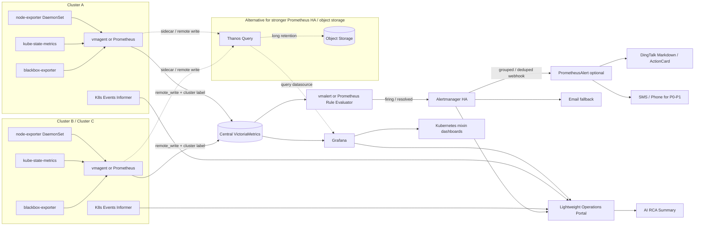

# 05-决策汇总

> 汇总日期：2026-06-09  
> 输入文件：`01-产品形态.md`、`02-API服务.md`、`03-开源项目.md`、`04-实现方案.md`。  
> 标注说明：本文结论均来自前 4 份调研；`[基于01]`、`[基于02]`、`[基于03]`、`[基于04]`
> 表示对应调研文件；`[双路 ✅]`、`[单源 ⚠️]`、`[冲突 ⚠️]` 保留原调研的证据强度。

---

## 1. 产品形态决策

**推荐：**做一个面向中型 K8s 集群的轻量级“集群总览 + 告警治理 + 钉钉触达 +
AI 辅助排障”产品，核心形态是：**Prometheus-compatible 指标底座 + Alertmanager 式降噪内核 +
OnCall-lite 告警生命周期 + 钉钉优先触达 + AI 辅助 RCA 摘要**。[基于01][双路 ✅]

### 推荐理由

1. 中型场景（10-100 节点、1-3 集群）最核心的问题不是做全栈 SaaS，而是让运维人员快速知道
   “哪里坏了、影响谁、谁负责、下一步做什么”。[基于01][双路 ✅]
2. 产品首页应聚焦健康态势、容量风险、告警态势、最近事件与 P0/P1 快速入口，而不是堆满所有图表。[基于01][双路 ✅]
3. 告警中心应以“告警组 / alert group”为可处理单元，支持 Firing、Acknowledged、Silenced、Resolved、
   Suppressed/Inhibited 等状态，并提供确认、静默、升级、分派、恢复、时间线和审计。[基于01][双路 ✅]
4. AI 能力第一版只做辅助排障：影响范围、可能原因、相关指标 / K8s Event、建议检查项和告警摘要；
   不做自动修复或全自治运维。[基于01][双路 ✅]

### 为什么不用其他形态

- 不用纯 Prometheus + Alertmanager UI：它们适合作为告警内核，但缺少 ACK、分派、升级、时间线、
  钉钉卡片和 AI 摘要等面向值班人的产品体验。[基于01][双路 ✅]
- 不照搬 Datadog / New Relic / Dynatrace：这些是大型商业全栈可观测 SaaS，本项目目标规模更小，
  全量照搬会带来成本、复杂度、数据合规和实施门槛过高的问题。[基于01][单源 ⚠️]
- 不以 Zabbix 为主形态：Zabbix 的主机 / 网络监控经验可借鉴，但 K8s 的标签、namespace、Pod 生命周期、
  工作负载和 PromQL 生态更适合 Prometheus-compatible 路线。[基于01][单源 ⚠️]
- 不把 Grafana OnCall OSS 作为强依赖：其 OSS 长期状态在两路资料中存在时效冲突，只借鉴 Alert Group、
  ACK、Silence、Escalation 等交互概念。[基于01][冲突 ⚠️]
- 不直接用 Nightingale 替代整个产品：夜莺适合作为中文告警治理和多数据源平台参考，但本项目需要更聚焦
  K8s 中型集群信息架构与钉钉优先交互。[基于01][双路 ✅]

---

## 2. 告警通知渠道决策

### 2.1 钉钉实现

**推荐：**默认使用钉钉自定义机器人 Webhook 的 Markdown 消息；P0/P1 告警使用 ActionCard；
FeedCard 只作为低优先级日报 / 周报 / 趋势摘要的可选形态。[基于01][基于02][双路 ✅]

| 场景 | 推荐消息类型 | 理由 |
|---|---|---|
| 默认告警、恢复通知、分组摘要 | Markdown | 能表达级别、对象、持续时间、影响范围、触发值、建议动作和详情链接；模板简单，适合 Alertmanager 输出。[基于01][基于02][双路 ✅] |
| P0/P1 高优先级告警 | ActionCard | 支持按钮跳转，适合“查看详情 / Grafana / Runbook / 确认入口”等行动引导。[基于01][基于02][双路 ✅] |
| 日报、周报、低优先级资讯摘要 | FeedCard 可选 | FeedCard 更像多链接资讯流，缺少确认 / 静默 / 分派按钮语义，不适合默认告警。[基于01][冲突 ⚠️] |

钉钉加签使用 `timestamp + "\n" + secret` 作为待签名字符串，HMAC-SHA256 后 Base64 并 URL Encode；
`timestamp` 与系统时间相差超过 1 小时应视为非法请求。[基于02][双路 ✅]

钉钉消息长度存在 4000 / 5000 字符冲突，落地时模板按 3500-4000 字符安全阈值截断，长内容放详情页链接。[基于02][冲突 ⚠️]

### 2.2 短信服务商

**推荐：**默认接入阿里云短信或腾讯云短信之一，接口层抽象为 `SmsProvider`，预留华为云实现。[基于02][双路 ✅]

| 服务商 | 低量档价格 | 免费额度 | 接入难度 | 决策 |
|---|---:|---|---:|---|
| 阿里云短信 | 通知 / 验证码低量档约 0.045 元/条。[基于02][双路 ✅] | 新用户免费试用 200 条；路 B 进一步称企业 200 条、个人 100 条。[基于02][双路 ✅] | 2/5 | 阿里云 ACK / 阿里云账号体系内优先。[基于02] |
| 腾讯云短信 | 自定义套餐低量档约 0.050 / 0.047 / 0.045 元/条。[基于02][双路 ✅] | 200 / 500 条存在冲突，以控制台为准。[基于02][冲突 ⚠️] | 2/5 | 腾讯云 / 企微 / 微信生态内优先。[基于02] |
| 华为云消息&短信 | 行业短信低量档约 0.065 元/条。[基于02][双路 ✅] | 未查到明确免费赠送额度。[基于02][单源 ⚠️] | 3/5 | 已有华为云 CCE / 统一采购时可选。[基于02] |

P0/P1 告警才使用短信，短信内容控制在 70 字以内，长详情放到监控详情页 / Runbook 链接，避免长短信拆分计费。[基于02][双路 ✅]

### 2.3 邮件渠道

**推荐：**邮件作为兜底和审计渠道保留，不作为唯一 P0 告警渠道。[基于02][双路 ✅]

Alertmanager 原生 Email Receiver 支持全局 SMTP 配置、receiver 级 `email_configs`、`send_resolved`、HTML 模板、
邮件头覆盖和 TLS 要求，配置完整性足够。[基于02][双路 ✅]

### 2.4 通知链路最终决策

最终链路：Prometheus / vmalert → Alertmanager → 钉钉 Markdown / ActionCard；必要时 Alertmanager Webhook →
PrometheusAlert → 短信 / 电话 / 企微 / 飞书等国内渠道。[基于02][基于04][双路 ✅]

---

## 3. 开源复用决策

### 3.1 fork / 借鉴 / 直接使用

**核心原则：不 fork 通用监控基础设施，直接集成成熟组件；只在统一运维门户、责任人映射、规则模板、
通知配置和告警生命周期体验上做少量自研。**[基于03][基于04][双路 ✅]

| 模块 | 决策 | 项目 | 理由 |
|---|---|---|---|
| 指标采集 / PromQL | 直接使用 | `prometheus/prometheus` | Prometheus 是事实标准，Star 约 64k；不建议 fork 主仓库。[基于03][双路 ✅] |
| 节点指标 | 直接使用 | `prometheus/node_exporter` | DaemonSet 部署即可覆盖 CPU、内存、磁盘、网络等节点指标。[基于03][双路 ✅] |
| K8s 对象状态 | 直接使用 | `kubernetes/kube-state-metrics` | 暴露 Pod、Node、Deployment 等对象状态，是 K8s 监控核心组件。[基于02][基于03][双路 ✅] |
| 预置规则 / 大盘 | 直接使用 / 参考 | `prometheus-operator/kube-prometheus` | 内置 Prometheus、Alertmanager、node-exporter、kube-state-metrics、Grafana、规则和 Dashboard。[基于03][双路 ✅] |
| 长期存储 | 直接使用 | `VictoriaMetrics/VictoriaMetrics` | 中型 1-3 集群优先用 VictoriaMetrics 降低 Thanos 编排复杂度。[基于03][基于04][双路 ✅] |
| 告警路由 / 静默 / 抑制 | 直接使用 | `prometheus/alertmanager` | 官方去重、分组、路由、静默、抑制核心组件。[基于03][基于04][双路 ✅] |
| 钉钉单渠道 | 直接使用或参考 | `timonwong/prometheus-webhook-dingtalk` | 轻量适配 Alertmanager → 钉钉；但维护活跃度较低。[基于03][双路 ✅] |
| 多渠道通知 | 拆模块复用 / 参考 | `feiyu563/PrometheusAlert` | 覆盖钉钉、企微、飞书、邮件、短信、电话等国内渠道。[基于03][基于04][双路 ✅] |
| 告警运营模型 | 参考 / 集成评估 | `ccfos/nightingale` | 借鉴业务组、静默、订阅、通知规则、事件 pipeline、历史告警统计。[基于03][双路 ✅] |
| 可视化 | 直接部署，不深度二次分发 | `grafana/grafana` | Dashboard 事实标准；AGPL-3.0 需关注商业闭源分发合规。[基于03][双路 ✅] |
| 多集群 / 长期对象存储 | 二期可选 | `thanos-io/thanos` | 适合 Prometheus HA、对象存储长期保留和全局查询；一期对 1-3 集群偏重。[基于03][基于04][双路 ✅] |
| 日志关联 | 二期可选 | `grafana/loki` | 可用于告警跳转 Pod 日志；非指标告警 MVP 必需，且 AGPL-3.0 需合规评估。[基于03][双路 ✅] |

### 3.2 推荐组合

**MVP / 最小化自研：**`kube-prometheus` + Prometheus + Alertmanager + node_exporter + kube-state-metrics + Grafana，
通知接 `prometheus-webhook-dingtalk` 或 PrometheusAlert。[基于03][双路 ✅]

**产品化版本 / 适度自研：**Prometheus / vmagent + VictoriaMetrics + PrometheusRule / vmalert + Alertmanager +
PrometheusAlert 渠道适配 + 参考 Nightingale 的告警模型 + 自研统一运维门户。[基于03][基于04][双路 ✅]

### 3.3 为什么不选择直接 fork

- 不 fork Prometheus / Alertmanager / Grafana：这些是成熟基础设施，fork 会带来升级、兼容、安全补丁和 License 维护成本。[基于03][双路 ✅]
- 不直接 fork PrometheusAlert 做主系统：它强在通知聚合和模板，弱在现代 K8s 监控门户、可视化、权限和多集群产品体验。[基于03][双路 ✅]
- 不直接 fork Nightingale 做全部产品：它强在中文告警运营，但不负责数据采集，也不是完整 K8s 中型集群门户。[基于03][双路 ✅]

---

## 4. 技术栈决策

| 层级 | 推荐技术栈 | 理由 | 为什么不用替代方案 |
|---|---|---|---|
| 数据采集层 | node-exporter + kube-state-metrics + blackbox-exporter + vmagent / Prometheus | 标准 Exporter 成熟，kube-state-metrics 用 list/watch 生成 K8s 对象状态指标，blackbox-exporter 支持 HTTP/TCP/DNS/ICMP/gRPC 探测。[基于04][双路 ✅] | 不自研 Agent，因为会重复实现采集、服务发现、缓存、重试、权限和指标格式；不用中心 Pull 作为主路径，因为跨集群网络和 RBAC 复杂。[基于04][双路 ✅] |
| 指标存储层 | 中心 VictoriaMetrics vmsingle 起步，生产用 vmcluster；保留 Prometheus remote_write 兼容 | 适合 1-3 个中型集群统一存储和 Grafana 查询，复杂度低于 Thanos / Cortex / Mimir 全套。[基于04][双路 ✅] | 不只用 Prometheus 本地盘，因为本地存储不复制、不集群化；不一期上 Cortex/Mimir，因为多租户超大规模复杂度偏高。[基于04][双路 ✅] |
| 告警规则引擎 | PrometheusRule / VMRule + PromQL；Prometheus evaluator 或 vmalert | 复用 kubernetes-mixin 规则和 Prometheus 生态，规则可 GitOps 管理并发送到 Alertmanager。[基于04][双路 ✅] | 不自研规则引擎，因为规则状态、`for` 持续时间、恢复通知、评估调度和状态机已有成熟实现。[基于04][双路 ✅] |
| 通知网关 | Alertmanager 作为唯一收敛入口 + Webhook 到 PrometheusAlert / 钉钉适配器 | Alertmanager 做 dedup、grouping、routing、silence、inhibition；PrometheusAlert 补齐钉钉、企微、飞书、短信、电话等国内渠道。[基于04][双路 ✅] | 不让 PrometheusAlert 替代 Alertmanager 的收敛职责；不一期自研完整多渠道网关。[基于04][双路 ✅] |
| 多集群管理 | 每集群本地采集 + `external_label: cluster` + 中心 VictoriaMetrics / Grafana | 兼顾本地服务发现、跨集群容错和中心统一视图，适合 1-3 集群。[基于04][双路 ✅] | 不中心 Prometheus 跨集群 Pull；Thanos 保留为已有对象存储 / Prometheus HA 经验团队的替代方案。[基于04][双路 ✅] |
| 运维大盘 | Grafana + kubernetes-mixin / kube-prometheus-stack / VictoriaMetrics K8s Stack Dashboard | Grafana 和 kubernetes-mixin 已提供成熟 K8s Dashboard、Prometheus alerts 和多集群配置能力。[基于04][双路 ✅] | 不一期自建完整大盘和告警配置 UI；自研 UI 只聚焦组织流程、责任人映射和轻量总览。[基于04][双路 ✅] |
| K8s API 访问 | kube-state-metrics 指标为主，Events API Informer 为诊断上下文；中心 kubeconfig + 集群内 ServiceAccount Token | 指标主链路避免高频直接访问 API Server；Events 适合故障上下文；多集群认证兼顾集中管理和最小 RBAC。[基于02][双路 ✅] | 不把 Events 作为唯一告警触发源，因为 Events 生命周期短且可能被聚合 / 丢弃。[基于02][双路 ✅] |

---

## 5. 架构总图

该架构采用“每集群本地采集、中心统一存储 / 查询、Alertmanager 统一收敛、PrometheusAlert 可选适配国内渠道、
Grafana 提供大盘、轻量门户提供告警生命周期与 AI RCA 摘要”的数据流。[基于04][双路 ✅]

---

## 6. 成本估算

> 说明：短信价格来自 `02-API服务.md`；服务器费用未在 01-04 中做云厂商逐项报价，以下按容量规划做工程估算，
> 采购前应以实际云厂商、地域、包年包月 / 按量、磁盘类型和已有集群资源为准。[基于02][基于04][单源 ⚠️]

### 6.1 资源容量基线

100 节点集群在 30 秒 scrape interval、150k-300k 活跃时间序列假设下，建议按 2-4GiB/日/集群规划指标数据；
30 天保留建议单 100 节点集群预留 150-300GiB 可用存储，3 个集群集中存储按 450-900GiB 起步。[基于04][单源 ⚠️]

### 6.2 每月预算建议

| 场景 | 服务器 / 存储估算 | 短信估算 | 月预算结论 |
|---|---:|---:|---:|
| 单集群 MVP（10-50 节点，已有 K8s 资源内部署） | 主要消耗现有集群资源，额外云服务器可为 0；如单独部署中心节点，按 4-8C / 16-32GiB / 200-500GiB SSD 估算约 500-1,200 元/月。[工程估算 ⚠️] | P0/P1 100-500 条/月，按 0.05 元/条约 5-25 元/月。[基于02][双路 ✅] | 约 500-1,225 元/月；若完全复用现有集群资源，现金成本主要是短信费。[工程估算 ⚠️] |
| 标准中型（1-3 集群，50-100 节点/集群） | 中心 VictoriaMetrics + Grafana + Alertmanager + PrometheusAlert，按 8-16C / 32-64GiB / 500GiB-1TiB SSD 估算约 1,200-3,000 元/月。[工程估算 ⚠️] | P0/P1 500-2,000 条/月，按 0.05 元/条约 25-100 元/月。[基于02][双路 ✅] | 约 1,225-3,100 元/月。[工程估算 ⚠️] |
| 高保留 / 高可用版（3 集群，90 天核心指标保留） | vmcluster / 多副本 / 更大磁盘，按 16C+ / 64GiB+ / 1-2TiB SSD 估算约 3,000-6,000 元/月。[工程估算 ⚠️] | P0/P1 1,000-5,000 条/月，按 0.05 元/条约 50-250 元/月。[基于02][双路 ✅] | 约 3,050-6,250 元/月。[工程估算 ⚠️] |

**推荐预算口径：**立项 MVP 先按标准中型低档预留，即每月约 **1,500-3,000 元**，其中短信成本通常低于 100 元/月，
主要成本来自中心存储、Grafana / Alertmanager / PrometheusAlert 运行资源和指标保留。[基于02][基于04][单源 ⚠️]

---

## 7. 风险与对策

| 风险 | 影响 | 对策 |
|---|---|---|
| 指标高基数膨胀 | 存储、查询和告警评估成本快速上升。[基于04][路A] | 限制 kube-state-metrics 资源与标签、规范业务 label、设置 scrape interval、使用 recording rule 和 cardinality Dashboard。[基于04][双路 ✅] |
| Prometheus 本地磁盘打满 | 本地 TSDB 采集和查询受影响。[基于04][路A] | 设置 retention.size 为磁盘 80-85%，监控 WAL/head/block 大小，remote_write 到中心存储。[基于04][路A] |
| kube-state-metrics / Watch 压力 | API Server / etcd 压力增大，Watch 延迟上升。[基于02][基于04][单源 ⚠️] | 使用 kube-state-metrics 指标主链路、共享 Informer、资源过滤、限制 watch 范围、监控 Watch 延迟。[基于02][基于04][双路 ✅] |
| 告警风暴 | 大量症状告警淹没值班人员，钉钉 Webhook 可能限流。[基于01][基于02][基于04][双路 ✅] | Alertmanager `group_by`、`group_wait`、`group_interval`、`repeat_interval` 和 inhibition；Webhook 层限速队列；P0 才短信兜底。[基于02][基于04][双路 ✅] |
| 责任人标签漂移 | 告警路由到错误团队或无人接收。[基于04][单源 ⚠️] | namespace / service owner 标签准入校验、定期扫描无 owner 资源、责任人映射 GitOps 审批。[基于04][单源 ⚠️] |
| 短信签名 / 模板 / 报备周期不可控 | 上线时短信通道不可用。[基于02][双路 ✅] | 项目启动即申请资质、签名、模板；排期预留 7-15 工作日；预算按无免费额度保守估算。[基于02][冲突 ⚠️] |
| 钉钉消息长度冲突 | 消息过长可能发送失败或被截断。[基于02][冲突 ⚠️] | 模板按 3500-4000 字符截断，长内容放详情页链接。[基于02][冲突 ⚠️] |
| SMTP / Exchange 策略限制 | 邮件兜底不可用。[基于02][双路 ✅] | 预上线测试 STARTTLS 587、SMTP AUTH、MFA / 条件访问 / OAuth 或应用密码策略。[基于02][双路 ✅] |
| ServiceAccount 长期 token 泄露 | 集群信息泄露或越权访问。[基于02][双路 ✅] | 最小 RBAC、临时 / 投影 token、定期轮换、Secret 加密和审计。[基于02][双路 ✅] |
| 中心存储单点 | 多集群统一视图和中心规则评估不可用。[基于04][路B] | 生产使用 vmcluster 或 Thanos HA；保留每集群本地关键告警；监控 remote_write 队列和中心存储健康。[基于04][双路 ✅] |
| Grafana / Loki AGPL 合规 | 商业闭源二次分发有合规风险。[基于03][双路 ✅] | 直接部署 / 集成，避免深度二次分发；商业化前做 License 审查。[基于03][双路 ✅] |
| AI RCA 过度承诺 | 误导值班人员或产生错误自动化动作。[基于01][双路 ✅] | 第一版只做辅助摘要和建议动作，不做自动修复；所有 ACK、静默、升级、恢复由人或明确规则触发。[基于01][双路 ✅] |

---

## 8. 冲突信息处理

| 来源文件 | [冲突 ⚠️] 事实点 | 双方信息 | 本次取舍 |
|---|---|---|---|
| 01-产品形态 | Grafana OnCall OSS 是否适合作为长期依赖 | 路 A 搜索仍描述 self-hosted / OSS On-call；路 B 提示 2026 进入 maintenance / archived，建议 Grafana Cloud IRM。[基于01][冲突 ⚠️] | 不把 OnCall OSS 作为强依赖，只借鉴 Alert Group、ACK、Silence、Escalation 交互。[基于01] |
| 01-产品形态 | FeedCard 是否适合告警归并 | 路 A 官方消息类型显示 FeedCard 是多链接图片卡片且无动作按钮；路 B 认为适合 grouped alerts。[基于01][冲突 ⚠️] | 默认不用 FeedCard；P0/P1 用 ActionCard，常规告警用 Markdown，FeedCard 只用于低优先级摘要。[基于01] |
| 01-产品形态 | Datadog Bits AI 页面路径 | 路 B 抓取 `product/bits-ai/` 返回 404，但搜索结果称 Bits AI SRE 存在；路 A 未抓到 Bits AI 官方正文。[基于01][冲突 ⚠️] | 不否定 Datadog AI 产品存在，但不引用未双路验证的量化指标，只按 `[单源 ⚠️]` 处理。[基于01] |
| 02-API服务 | 钉钉 Markdown / ActionCard 正文长度 | 路 A 同时出现 5000 字符和 4000 字符说法；路 B 认为正文限制为 5000 字符。[基于02][冲突 ⚠️] | 模板按 3500-4000 字符截断，超长内容放详情页链接。[基于02] |
| 02-API服务 | 腾讯云短信免费额度 | 路 A 官方价格页显示企业 200 条、个人 100 条；路 B 一次结果称企业 500 条，另一次称 200 / 100 条。[基于02][冲突 ⚠️] | 预算按 0 免费额度保守估算，最终以控制台开通页为准。[基于02] |
| 02-API服务 | 阿里云短信审核周期 | 路 A 出现 2 小时、24 小时、3-5 工作日、运营商报备 7-15 工作日等说法；路 B 认为签名约 2 小时、运营商报备 5-10 工作日。[基于02][冲突 ⚠️] | 排期按“平台审核当天完成、正式稳定可发预留 7-15 工作日”规划。[基于02] |
| 03-开源项目 | `prometheus/prometheus` Star / pushed_at 动态差异 | 路 A API：64,186 stars，pushed_at 2026-05-29；路 B API：64,394 stars，pushed_at 2026-06-09。[基于03][冲突 ⚠️] | GitHub 动态数据按时间点保留，不影响选型；主表可采用较新的路 B 值。[基于03] |
| 03-开源项目 | `timonwong/prometheus-webhook-dingtalk` 仓库名称 | 用户候选写作 `alertmanager-webhook-dingtalk`；实际主仓库为 `timonwong/prometheus-webhook-dingtalk`。[基于03][冲突 ⚠️] | 按实际主仓库记录，文档中注明别名 / 候选名差异。[基于03] |
| 04-实现方案 | VictoriaMetrics 性能优势证据强度 | 路 B 明确推荐 VictoriaMetrics 并称资源 / 存储效率更优；路 A 本轮未抓到独立量化性能页面。[基于04][单源 ⚠️] | 仍推荐 VictoriaMetrics 作为中型场景优先方案，但性能优势按 `[单源 ⚠️]` 处理，POC 阶段用真实 samples/s 验证。[基于04] |
| 04-实现方案 | VictoriaMetrics vs Thanos 偏好 | 路 A 的 kubernetes-mixin 多集群文档更偏 Thanos / external_labels；路 B 更倾向 VictoriaMetrics 做中型统一存储。[基于04][双路 ✅] | 视为架构偏好差异而非事实冲突：默认 VictoriaMetrics，已有对象存储 / Prometheus HA 经验时可选 Thanos。[基于04] |

---

## 9. 最终落地建议

### 9.1 MVP 范围

1. 单集群先跑通采集、中心存储、Grafana 大盘、PrometheusRule / vmalert、Alertmanager、钉钉 Markdown 通知。[基于04][双路 ✅]
2. 接入 kube-state-metrics 的 Pod / Node / Workload 指标，覆盖 NotReady、CrashLoopBackOff、OOMKilled、Pod Pending、
   Deployment 副本不可用、磁盘 / 内存 / CPU 水位等核心规则。[基于02][基于04][双路 ✅]
3. 告警收敛默认按 `cluster + namespace + alertname + service` 分组，P0/P1 使用 ActionCard 和短信兜底。[基于01][基于02][基于04][双路 ✅]
4. 自研轻量门户只做集群总览、告警中心、通知配置、告警详情 / AI 摘要入口，不重写 Grafana、Prometheus、Alertmanager 核心能力。[基于01][基于04][双路 ✅]

### 9.2 二期范围

1. 扩展到 1-3 集群统一视图：每集群 vmagent / Prometheus remote_write 到中心 VictoriaMetrics。[基于04][双路 ✅]
2. 引入 PrometheusAlert 或自研轻量适配层，补齐短信、电话、企微、飞书等多渠道。[基于03][基于04][双路 ✅]
3. 参考 Nightingale 的业务组、订阅、pipeline、历史告警统计和规则模板管理。[基于03][双路 ✅]
4. AI RCA 从“摘要 + 建议检查项”开始，逐步加入相关 K8s Events、最近变更、日志链接和影响面分析。[基于01][双路 ✅]

### 9.3 下一步建议

`03-开源项目.md` 与本文都给出了至少两个候选技术组合：最小化自研方案与适度自研方案，并涉及
VictoriaMetrics / Thanos、PrometheusAlert / Nightingale 等取舍。[基于03][基于04][双路 ✅]

因此，进入 PRD 前建议先做一次架构基线对抗调研，产出 `specs/research/06-架构基线决策.md`；如果跳过，
至少在 brainstorming 阶段明确锁定“最小化自研 MVP”还是“适度自研产品化版本”。[基于03][基于04]
