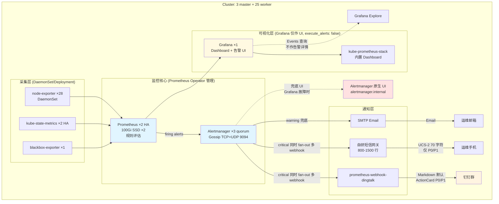

# 06-实际部署决策

> 文档定位：基于前 5 份调研（`01-产品形态.md` ~ `05-决策汇总.md`）的通用结论，
> 结合**实际生产部署约束**（1 集群、3 master + 25 worker、短期不扩展到 3+ 集群）
> 做出的最终技术决策。本文档是落地实施的权威依据，覆盖 `05-决策汇总.md` 中
> 因场景不明确而保留的候选项。
>
> 决策日期：2026-06-22  
> 场景依据：单集群 28 节点（3 master + 25 worker），未来 12-18 个月不扩展到 3+ 集群。

---

## 1. 场景约束分析

### 1.1 实际规模

| 指标 | 数值 | 含义 |
|---|---|---|
| 当前规模 | 3 master + 25 worker = 28 节点 | 中型偏小，远低于 100 节点容量上限 |
| 集群数 | 1 个 | 短期不会扩展到 3+ 集群 |
| 活跃时间序列估算 | ~50k-100k | 远低于容量担忧线 |
| 每日数据量 | ~0.5-1.5 GiB（scrape interval 30s） | 本地存储完全够用 |
| 30 天保留 | ~30-45 GiB | 一块 100 GiB SSD 即可覆盖 |
| 多集群需求 | 无 | **Thanos / Cortex / VM Cluster 的核心价值失效** |

### 1.2 约束直接砍掉的方案

| 候选方案 | 砍掉理由 |
|---|---|
| Thanos（Sidecar/Query/Store/Compactor/Receiver） | 1 集群无多 Prometheus HA 去重、无全局查询需求；对象存储长保留可用 `vmbackup` 替代 |
| Cortex / Mimir | 多租户超大规模方案，复杂度远超 28 节点场景所需 |
| VictoriaMetrics vmcluster（三组件） | 单集群 vmsingle 甚至本地 Prometheus 已足够，vmcluster 属于过度工程 |
| Nightingale 作为主告警平台 | 告警运营平台价值在多业务组、多数据源、多集群，1 集群单团队场景偏重 |
| 自研多渠道通知网关 | 1 集群用 `prometheus-webhook-dingtalk` + 薄薄短信 SDK 即可 |
| 跨集群 ServiceAccount / kubeconfig 路由 | 1 集群用本地 ServiceAccount 即可 |

---

## 2. 对抗调研结论：全部不再需要

`05-决策汇总.md` 末尾列出的 3 个候选对抗调研点，在当前场景下全部不再需要：

### ✅ 对抗 1（VictoriaMetrics vs Thanos）— 直接判 Thanos 出局

**结论**：直接用 Prometheus 本地 TSDB + 30 天保留。可选加一个 `vmagent` 远程写到
`vmsingle` 做热备（非必需）。

**理由**：
1. Thanos 三大卖点对 1 集群都不成立：多 Prometheus HA 去重 / 对象存储长保留 / 全局查询
2. VictoriaMetrics cluster 版同样过度工程，单集群 vmsingle 都偏重
3. 28 节点 × 100k 活跃序列，Prometheus 本地 TSDB 的查询性能和存储效率完全够用
4. 灾备可通过 `vmbackup` 到对象存储实现（可选，非必需）

### ✅ 对抗 2（PrometheusAlert vs Nightingale vs 自研）— 直接用最简方案

**结论**：一期直接用 `prometheus-webhook-dingtalk` + Alertmanager 原生 Email + 
自研薄薄短信 SDK（~50-100 行代码）。

**理由**：
1. 1 集群场景下 PrometheusAlert 的"多渠道告警中心"价值大打折扣
2. Nightingale 的业务组、多数据源、多集群统一告警平台对单集群单团队过重
3. 通知渠道只有 3 类（钉钉 / 邮件 / 短信），自研适配比运维一个额外平台简单
4. 如未来真需要多渠道聚合，再评估 PrometheusAlert 作为二期增强

### ✅ 对抗 3（vmalert vs Prometheus Rule Evaluator）— 不存在

**结论**：直接用 Prometheus 本地规则评估（`PrometheusRule` CRD）。

**理由**：跟随对抗 1 结论，1 集群用 Prometheus 本地规则天然合理。

---

## 3. 锁定的技术栈（可直接动工）

### 3.0 技术选型速查表

> 一眼看全的技术选型总览。详细配置见 §3.1-§3.12，决策依据见 §6。

#### 采集层

| 组件 | 选型 | 部署模式 | 关键参数 |
|---|---|---|---|
| 节点指标 | `node-exporter` | DaemonSet（28 副本，含 master）| 200m CPU / 128Mi 内存 |
| K8s 对象状态 | `kube-state-metrics` | Deployment（**2 副本 HA**）| 500m / 512Mi |
| 黑盒探测 | `blackbox-exporter` | Deployment（1 副本）| 100m / 128Mi |

#### 存储与规则层

| 组件 | 选型 | 部署模式 | 关键参数 |
|---|---|---|---|
| 指标存储 | `Prometheus` 本地 TSDB | StatefulSet（**2 副本 HA**）| 2 CPU / 8Gi / 100Gi SSD × 2，30 天保留 |
| 告警规则引擎 | `PrometheusRule` CRD | Prometheus 本地评估 | 30s 评估间隔，GitOps 管理 |
| 告警收敛 | `Alertmanager` | StatefulSet（**3 副本 quorum**）| 100m-500m / 256-512Mi / 5Gi × 3，Gossip 9094 TCP+UDP |

#### 通知层

| 组件 | 选型 | 部署模式 | 关键参数 |
|---|---|---|---|
| 钉钉适配 | `prometheus-webhook-dingtalk` | Deployment | 加签认证，Markdown/ActionCard |
| 短信网关 | 自研（**一期 NoOp 占位**）| 不部署 | SmsProvider 接口预留 |
| 邮件 | Alertmanager 原生 Email Receiver | - | SMTP STARTTLS 587 |

#### 可视化层

| 组件 | 选型 | 部署模式 | 关键参数 |
|---|---|---|---|
| 仪表盘 | `Grafana` + kube-prometheus-stack Dashboard | Deployment（**1 副本，无 HA**）| 500m / 512Mi-1Gi / 10Gi |
| 告警 UI | Grafana Alerting（仅 UI 层）| - | ⚠️ `execute_alerts: false` |

#### 部署与配置管理

| 组件 | 选型 | 关键约束 |
|---|---|---|
| 部署方式 | Helm + Prometheus Operator | `kube-prometheus-stack` chart |
| GitOps | `ArgoCD`（主）+ Helm/kubectl（手动备选）| 内网 Ingress only，polling 模式（3 分钟延迟） |
| 配置仓库 | Git（公网优先，内网 GitLab 可选）| PrometheusRule / AlertmanagerConfig CRD 化 |

#### 访问与安全

| 项 | 选型 | 关键约束 |
|---|---|---|
| 访问方式 | **复用公司自有 VPN** | 不暴露公网，内网 IP 白名单二次过滤 |
| 暴露域名 | Grafana / Alertmanager / ArgoCD 3 个内网域名 | 都走 VPN |
| Prometheus lifecycle API | **禁用** | 用 Operator reload，避免 HTTP API 销毁实例 |

#### 监控模型与范围

| 项 | 选型 | 关键约束 |
|---|---|---|
| 告警分级 | severity 4 级：`critical`/`warning`/`info`/`none` | 对应 P0/P1/P2/P3 |
| SLO 范围 | 4 个基础资源 SLI（节点/Pod/API Server/Prometheus） | 不做错误预算 |
| Meta-monitoring | **第 1 层**（8 条自监控规则 + Watchdog 1h 心跳） | 第 2-3 层推迟二期 |
| 升级策略 | 仅钉钉 @多人（P0 @值班+备份）| 不做电话兜底，不做自动升级链 |

#### 一期范围边界

| 范围 | 包含 | 不包含（推迟二期） |
|---|---|---|
| 一期 | K8s 资源监控 + 告警通知（钉钉/邮件） | 业务指标埋点 |
| 一期 | Meta-monitoring 第 1 层 | 中间件 Exporter（MySQL/Redis） |
| 一期 | 简化版 SLO（4 个资源 SLI） | blackbox 业务 API 探活 |
| 一期 | - | AI RCA |
| 一期 | - | 自研门户 |

#### 工作量与排期

| 项 | 数值 |
|---|---|
| 一期总工作量 | **37.5-64 人天**（1.5-3.5 个月） |
| 二期增量触发条件 | 6-12 个月 / 规模翻倍 / 业务方主动 / 事故驱动 |

#### 完整决策索引

详细决策依据见 §6（30 项已决策汇总）。速查表与 §6 的对应关系：

| 速查表分组 | 对应 §6 决策编号 |
|---|---|
| 采集层 | 决策 2-3（HA 副本数） |
| 存储与规则层 | 决策 2-3, 13, 15 |
| 通知层 | 决策 5, 11, 12 |
| 可视化层 | 决策 1, 4 |
| 部署与配置管理 | 决策 15-19 |
| 访问与安全 | 决策 8-10 |
| 监控模型与范围 | 决策 20-21, 27-30 |
| 一期范围边界 | 决策 22-26 |

---

### 3.1 采集层

| 组件 | 部署模式 | 副本数 | 资源配额 |
|---|---|---:|---|
| `node-exporter` | DaemonSet | 28（每节点 1 个） | 200m CPU / 128Mi 内存 |
| `kube-state-metrics` | Deployment | **2（HA 无状态）** | 500m / 512Mi |
| `blackbox-exporter` | Deployment | 1 | 100m / 128Mi |

> ⚠️ 资源配额已按官方推荐 + 28 节点真实负载修订。原方案的 32Mi / 256Mi 在生产
> 负载下会 OOM，导致 1-2 周内组件 CrashLoopBackOff。

### 3.2 存储与规则层

| 组件 | 部署模式 | 副本数 | 资源 / 存储 |
|---|---|---:|---|
| `Prometheus` | StatefulSet（Prometheus Operator 管理） | **2（HA）** | 2 CPU / 8Gi 内存 / 100Gi SSD PVC × 2 |
| `Alertmanager` | StatefulSet（反亲和 + 拓扑分布） | **3（quorum HA）** ⚠️ | 100m-500m / 256-512Mi / 5Gi × 3 |
| `Grafana` | Deployment | **1（无 HA，K8s 自动重启）** ⚠️ | 500m / 512Mi-1Gi / 10Gi |

**关键配置**：
- Prometheus: `retention: 30d`，`retentionSize: 85GiB`（**绝对值，非百分比**，触发旧块删除）
- `scrapeInterval: 30s`，`evaluationInterval: 30s`
- ⚠️ **禁用** `--web.enable-lifecycle`（避免 HTTP API 销毁实例的安全风险），改用 Prometheus Operator 的 `reloadStrategy: HTTP`
- Prometheus 启用 `enableAdminAPI: false`，禁用 admin API
- Alertmanager: `replicas: 3`（quorum），`podAntiAffinity: requiredDuringSchedulingIgnoredDuringExecution`
- Alertmanager: `topologySpreadConstraints` 强制跨节点，Gossip 端口 9094（**TCP + UDP**）
- Alertmanager: `PodDisruptionBudget minAvailable: 2`，保证维护期至少 2 副本可用
- Grafana: `unified_alerting.execute_alerts: false`（⚠️ **强制约定**：仅作 UI 层，不参与规则评估）
- Grafana: Dashboard ConfigMap 化 + GitOps 版本管理（不能只存 PVC）

> ⚠️ **HA 副本数硬性约束**：
> - Alertmanager **必须 3 副本**。2 副本在网络分区时无法形成 quorum，会导致双发告警。
> - Prometheus 2 副本是独立采集 + Alertmanager 去重的模式，不是主备。
> - Grafana 1 副本是务实选择，前提是 `execute_alerts: false`，告警评估由 Prometheus 完成。

### 3.3 告警规则层

- 使用 `PrometheusRule` CRD 管理（GitOps 友好）
- 复用 `kubernetes-mixin` / `kube-prometheus-stack` 默认规则集
- 裁剪不需要的规则，新增业务规则
- 规则源放在 `monitoring/rules/` 目录，通过 ArgoCD/Flux 或 Helm 同步

### 3.4 通知路由层

**Alertmanager 路由树**（语法修正版）：

```yaml
global:
  resolve_timeout: 5m

route:
  receiver: default
  group_by: [alertname, namespace, severity]
  group_wait: 30s
  group_interval: 5m
  repeat_interval: 4h
  routes:
    # ⚠️ Watchdog 单独路由：1 小时一次，发到独立"监控健康"钉钉群
    # 不发到主告警群，避免刷屏让运维屏蔽整个群
    - matchers: [alertname="Watchdog"]
      receiver: watchdog-only
      group_wait: 0s
      group_interval: 1h
      repeat_interval: 1h
    - matchers: [severity="critical"]
      receiver: dingtalk-actioncard-sms
      group_wait: 0s
      repeat_interval: 1h
    - matchers: [severity="warning"]
      receiver: dingtalk-markdown
      repeat_interval: 4h

receivers:
  - name: default
    email_configs:
      - to: ops@example.com
        send_resolved: true

  - name: dingtalk-markdown
    webhook_configs:
      - url: http://prometheus-webhook-dingtalk.monitoring.svc:8060/dingtalk/dingtalk-markdown/send
        send_resolved: true

  - name: dingtalk-actioncard-sms
    webhook_configs:
      # 同一 receiver 配多个 webhook_configs，Alertmanager 会全部触发
      - url: http://prometheus-webhook-dingtalk.monitoring.svc:8060/dingtalk/dingtalk-actioncard/send
        send_resolved: true
      - url: http://sms-gateway.monitoring.svc:8080/alert
        send_resolved: false  # 恢复不发短信，避免扰民

  - name: watchdog-only  # ⚠️ Watchdog 独立接收器
    webhook_configs:
      - url: http://prometheus-webhook-dingtalk.monitoring.svc:8060/dingtalk/watchdog-health/send
        send_resolved: false  # Watchdog 永远不 resolved

inhibit_rules:
  # critical 抑制 warning，避免根因已知时刷屏
  - source_matchers: [severity="critical"]
    target_matchers: [severity="warning"]
    equal: [namespace, alertname]
  # 节点 NotReady 抑制该节点上的 Pod 症状告警
  # source 用 Phase A 实际 alertname（06 原文 "KubeNodeNotReady" 在本规则集不存在——
  # Phase A 拆成了 KubeWorkerNodeNotReady / KubeMasterNodeNotReady / MultipleWorkerNodesNotReady
  # 三条，见 §3.12.6；用正则覆盖三条，否则 inhibit 匹配 0 成死规则。Phase B 实测修正）
  - source_matchers: [alertname=~"KubeWorkerNodeNotReady|KubeMasterNodeNotReady|MultipleWorkerNodesNotReady"]
    target_matchers: [alertname=~"KubePod.*|KubeContainer.*"]
    equal: [node]
```

**关键说明**：
- `webhook_configs` 是 URL 列表（**不是名字**），同一 receiver 配多个 webhook 即同时 fan-out
- `inhibit_rules` 必配，否则告警风暴时无法降级（节点故障时所有 Pod 告警一起触发）
- `send_resolved` 控制恢复通知（短信恢复不发，避免扰民；钉钉/邮件恢复发，闭环体验好）
- ⚠️ **钉钉消息自包含原则**：因访问 Grafana 需 VPN（响应延迟 2-5 分钟），
  P0/P1 ActionCard 消息必须**自包含**（嵌入 kubectl 命令、排障步骤、Runbook 公网链接），
  详见 §3.6.2

### 3.5 通知渠道

| 渠道 | 实现 | 触发条件 | 说明 |
|---|---|---|---|
| 钉钉 | `prometheus-webhook-dingtalk` + 自定义模板 | 所有告警默认 | Markdown 默认；P0/P1 用 ActionCard |
| 邮件 | Alertmanager 原生 Email Receiver | 兜底 + 审计 | SMTP STARTTLS 587 |
| 短信 | 自研 **800-1500 行** Go/Python 网关 + 阿里云/腾讯云 SDK | 仅 P0/P1 | **UCS-2 编码 70 字符**（长短信每段 67 字符）；建议用短链服务如 `https://mon.example.com/a/abc123` |
| 语音电话 | 二期评估 | P0 未 ACK 升级 | 一期不做 |

> ⚠️ **短信网关代码量修正**：原方案"~50-100 行"严重低估。真实代码量：
> - SDK 集成（签名、模板、错误码）：~200 行
> - 多服务商抽象层（SmsProvider 接口 + 实现）：~150 行
> - 重试、限频、错误处理、计费监控：~300 行
> - 模板渲染、变量校验、签名管理：~200 行
> - 单元测试 + 集成测试：~500 行
> - **合计 800-1500 行**，工作量 **8-12 人天**（不是 3-5 人天）

> ⚠️ **短信字符限制**：中文用 UCS-2 编码，单条 70 字符；长短信每段 67 字符。
> 实际告警内容（cluster/namespace/pod/alertname/链接）很难压到 70 字符，
> 链接本身占 30-50 字符。建议短信只放 `alertname + severity + 关键标识 + 短链`。

### 3.6 可视化（Grafana Alerting 仅作 UI 层）

**核心原则**：Grafana 仅作为 UI 层（Dashboard + 告警 UI），**不参与告警规则评估**。
所有规则评估由 Prometheus `PrometheusRule` CRD 完成。

**部署配置**：
- Grafana 单实例（1 副本，K8s 自动重启恢复，1-3 分钟内恢复服务）
- 启用 Grafana Alerting UI 模块（查看告警、ACK、静默、联系点）
- ⚠️ **强制约定**：`unified_alerting.execute_alerts: false`（永远不在 Grafana 评估规则）
- Dashboard ConfigMap 化 + GitOps 版本管理（不能只存 PVC）
- 配 readiness/liveness probe，快速发现故障
- 调度到 worker 节点（避免 master 故障影响）

**访问策略**：复用公司自有 VPN（详见 §3.6.1）

**兜底策略**：
- Grafana 故障时，通过 Alertmanager 原生 UI（`alertmanager.internal.example.com`）操作告警
- ⚠️ **注意**：Alertmanager UI 也走 VPN，VPN 故障时所有 UI 都不可达。
  因此钉钉告警消息必须**自包含**（详见 §3.6.2），运维不点链接也能处理告警。

**values.yaml 配置**：

```yaml
grafana:
  replicas: 1
  resources:
    requests: {cpu: 250m, memory: 512Mi}
    limits: {cpu: 1, memory: 1Gi}
  persistence:
    enabled: true
    size: 10Gi
    storageClassName: ssd
  readinessProbe:
    httpGet: {path: /api/health, port: 3000}
    initialDelaySeconds: 10
    periodSeconds: 10
  livenessProbe:
    httpGet: {path: /api/health, port: 3000}
    initialDelaySeconds: 30
    periodSeconds: 30
  nodeSelector:
    node-role.kubernetes.io/worker: "true"
  dashboardProviders:
    dashboardproviders.yaml:
      apiVersion: 1
      providers:
        - name: 'default'
          folder: ''
          type: file
          updateIntervalSeconds: 30
          options:
            path: /var/lib/grafana/dashboards
  dashboardsConfigMaps:
    default: grafana-dashboards
  grafana.ini:
    unified_alerting:
      enabled: true
      execute_alerts: false  # ⚠️ 关键：禁用 Grafana 自己评估规则
      alertmanager:
        - url: http://alertmanager-operated.monitoring.svc:9093
    alerting:
      enabled: true
  # 仅暴露内网 Ingress，不暴露公网
  service:
    type: ClusterIP
  ingress:
    enabled: true
    ingressClassName: nginx-internal
    hosts:
      - grafana.internal.example.com  # 内网 DNS，VPN 接入后可达
    annotations:
      nginx.ingress.kubernetes.io/whitelist-source-range: "10.0.0.0/8,172.16.0.0/12"  # 内网 IP 段
```

#### 3.6.1 访问架构（公司自有 VPN）

```
[运维设备]
   ↓ 公司 VPN 客户端（手机体验差，建议值班用笔记本 + 4G）
[公司 VPN 网关] ⚠️ 单点风险（见 §7）
   ↓ 内网路由（监控网络可达性由 IT 配置）
[K8s Ingress Controller（内网入口）]
   ↓
[Grafana / Alertmanager Service（ClusterIP + 内网 Ingress）]
```

**关键设计**：
- 所有监控 UI（Grafana / Alertmanager）共用同一内网 Ingress 入口
- **不暴露公网 Ingress**，避免攻击面
- VPN 已是认证层，不再加 Basic Auth；但建议加内网 IP 白名单二次过滤
- Prometheus UI 和短信网关 UI **不暴露 Ingress**，通过 `kubectl port-forward` 临时访问

**落地工作清单**：
1. 向 IT 申请 VPN 接入（运维团队账号）
2. VPN 路由配置：监控命名空间网段可达
3. K8s Ingress 内网域名（`*.internal.example.com`）
4. 内网 DNS 解析到 K8s Ingress Controller 内网 IP
5. （可选）内网 IP 白名单二次过滤

**工作量**：1-2 人天（复用已有 VPN，零新增组件）

#### 3.6.2 钉钉告警消息自包含策略

**原则**：告警消息必须**自包含**，运维不点链接也能处理告警（应对 VPN 体验差、P0 响应延迟 2-5 分钟）。

**修订后的钉钉 ActionCard 模板**（P0/P1）：

```
**[P0] KubePodCrashLooping**

集群: prod-cluster-1
命名空间: default
Pod: my-app-xxx-yyy
容器: my-container
持续: 12m
触发值: 容器 5 分钟内重启 8 次
最近事件: Back-off restarting failed container

👤 责任人: @张三
📖 Runbook: https://wiki.example.com/runbook/crashloop  ← ⚠️ 公网可访问
🔍 Grafana: https://grafana.internal.example.com/d/xxx  ← 需 VPN

操作建议（不依赖 UI）:
1. kubectl describe pod my-app-xxx-yyy -n default
2. kubectl logs my-app-xxx-yyy -c my-container --previous
3. 检查最近部署: kubectl rollout history deployment/my-app
```

**关键设计**：
- Runbook 链接放**公网可访问**位置（Wiki / Confluence 公开页面 / GitLab Pages），运维不需要 VPN 也能查
- Grafana 链接放最后（次要，深度排障用）
- 操作建议直接嵌入消息（kubectl 命令、排障步骤）
- 责任人 @值班人（钉钉强提醒，即使群消息免打扰）

### 3.7 K8s API 访问

- 本集群内 ServiceAccount Token + 最小 RBAC（`get/list/watch`）
- 不需要跨集群 kubeconfig 路由（单集群场景）
- 指标主链路：Prometheus → kube-state-metrics scrape（不直接高频访问 API Server）
- Events 通过 Grafana Explore 查看（**不做聚合告警详情页**，避免与"不自研门户"决策矛盾）
- Events 不作告警触发源（生命周期短、可能被聚合/丢弃）

### 3.8 部署方式

```bash
helm repo add prometheus-community https://prometheus-community.github.io/helm-charts
helm install kps prometheus-community/kube-prometheus-stack \
  -n monitoring --create-namespace \
  -f values.yaml
```

`values.yaml` 关键配置（修订完整版）：

```yaml
prometheus:
  prometheusSpec:
    replicas: 2  # HA
    retention: 30d
    retentionSize: 85GiB
    resources:
      requests: {cpu: 2, memory: 8Gi}
      limits: {cpu: 4, memory: 12Gi}
    storageSpec:
      volumeClaimTemplate:
        spec:
          storageClassName: ssd
          resources:
            requests:
              storage: 100Gi
    # ⚠️ 安全：禁用 lifecycle API 和 admin API
    enableAdminAPI: false
    # 默认不启用 --web.enable-lifecycle，通过 Operator reload
    # 告警发送到所有 Alertmanager（自动 failover）
    alertingEndpoints:
      - name: alertmanager-operated
        namespace: monitoring
        port: 9093
        pathPrefix: /
        apiVersion: v2
    # 规则评估由 Prometheus 完成（不是 Grafana）
    ruleSelector:
      matchLabels:
        release: kps

alertmanager:
  alertmanagerSpec:
    replicas: 3  # ⚠️ quorum HA，不是 2 副本
    podAntiAffinity: requiredDuringSchedulingIgnoredDuringExecution
    # kind 落地注意（生产 28 节点有足够 worker，无需此 toleration）：kind 仅 2 个无 taint worker，
    # 3 副本硬反亲和要散到 3 节点须容忍 control-plane taint，否则第 3 副本 Pending。kind MVP 需加：
    #   tolerations:
    #     - key: node-role.kubernetes.io/control-plane
    #       effect: NoSchedule
    topologySpreadConstraints:
      - maxSkew: 1
        whenUnsatisfiable: DoNotSchedule
        topologyKey: kubernetes.io/hostname
        labelSelector:
          matchLabels:
            app.kubernetes.io/name: alertmanager
    resources:
      requests: {cpu: 100m, memory: 256Mi}
      limits: {cpu: 500m, memory: 512Mi}
    storage:
      volumeClaimTemplate:
        spec:
          storageClassName: ssd
          resources:
            requests:
              storage: 5Gi
    retention: 120h
    cluster:
      listenAddress: "0.0.0.0:9094"
    podDisruptionBudget:
      minAvailable: 2
  config: |
    # 见 §3.4 完整路由树（含 inhibition_rules）

alertmanager:
  service:
    type: ClusterIP
  # ⚠️ Alertmanager 原生 UI 作为 Grafana 故障时的兜底
  ingress:
    enabled: true
    hosts:
      - alertmanager.internal.example.com
    annotations:
      nginx.ingress.kubernetes.io/auth-type: basic
      nginx.ingress.kubernetes.io/auth-secret: alertmanager-basic-auth

grafana:
  enabled: true
  replicas: 1  # 单实例，execute_alerts: false 保证不影响告警
  adminPassword: <from-secret>
  # 完整配置见 §3.6

kube-state-metrics:
  replicas: 2  # ⚠️ HA 无状态

prometheus-node-exporter:
  resources:
    requests: {cpu: 200m, memory: 128Mi}
    limits: {cpu: 500m, memory: 256Mi}
```

### 3.9 GitOps 工作流与 VPN 协同

**工具选型**：ArgoCD（主） + Helm/kubectl（手动备选）

**核心原则**：
- 告警规则、Alertmanager 配置、Grafana Dashboard 全部版本化到 Git
- ArgoCD 自动 sync，避免手动 kubectl apply 漂移
- 手动备选仅用于 ArgoCD 故障或紧急调优

#### 3.9.1 GitOps 6 个环节受 VPN 影响分析

| # | 环节 | 受 VPN 影响？ | 说明 |
|---:|---|---|---|
| 1 | ArgoCD **pull** Git 仓库 | ❌ **不受影响** | ArgoCD Pod 在集群内，集群网络直连 Git |
| 2 | ArgoCD **apply** 配置到 K8s | ❌ **不受影响** | In-cluster 操作，不走 VPN |
| 3 | 运维 **push** 配置到 Git | ⚠️ **取决于 Git 位置** | 内网 Git 需 VPN；公网 Git 不需要 |
| 4 | Git webhook 触发 ArgoCD sync | ⚠️ **架构问题** | 公网 Git webhook 推不到内网 ArgoCD，用 polling 模式 |
| 5 | 运维访问 **ArgoCD UI** | ✅ **需要 VPN** | 与 Grafana 同入口 |
| 6 | 运维 **argocd CLI** 操作 | ✅ **需要 VPN** | CLI 通过 ArgoCD API |

**关键结论**：核心同步链路（环节 1-2）**完全不受 VPN 影响**。
即使 VPN 全挂，ArgoCD 仍能正常 pull Git 并 apply 配置。
只有运维操作 ArgoCD 时（环节 5-6）才需要 VPN。

#### 3.9.2 Git 仓库位置选择（影响 push 是否需 VPN）

| 方案 | 运维 push 是否需 VPN | 适用场景 |
|---|---|---|
| **公司内网 GitLab**（自建） | ⚠️ 需要 VPN | 合规严格 / 已有内网 Git 基础设施 |
| **公网 Git**（GitHub / Gitee / GitLab Cloud） | ✅ 不需要 | 公司允许代码上公网 / 中小团队 |
| **内网 GitLab + 公网镜像** | ✅ 不需要 | 大型组织，运维任何场景都能 push |

**推荐**：如果公司允许代码上公网，**优先公网 Git**——
运维 push 不依赖 VPN，告警规则紧急调整更顺畅。

如果必须用内网 GitLab：接受"运维 push 需 VPN"代价，
紧急改动走 kubectl 绕过 GitOps（见 §3.9.3），事后补 PR。

#### 3.9.3 紧急操作 fallback（应对 VPN 不可用）

夜间 P0 告警需要立即调整规则，但 VPN 不可用时的操作优先级：

| 方案 | 是否破坏 GitOps | 紧急度 | 说明 |
|---|---|---|---|
| Alertmanager API 直接创建 silence | ❌ 不破坏 | ⭐⭐⭐ 首选 | silence 不属于 GitOps 范畴 |
| `kubectl edit PrometheusRule` 直接改 | ⚠️ 破坏（事后补 Git） | ⭐⭐ 次选 | 紧急调阈值用 |
| `kubectl apply -f` 重写规则 | ⚠️ 破坏（事后补 Git） | ⭐ 紧急用 | 紧急替换整条规则 |
| 等 VPN 恢复 | ❌ 不可接受 | - | P0 不能等 |

**Runbook 嵌入紧急操作脚本**（运维不需要 VPN 也能执行）：

```bash
# 紧急静默（通过 Alertmanager API，需在集群节点或同 VPC 执行）
curl -X POST http://alertmanager-operated.monitoring.svc:9093/api/v2/silences \
  -H "Content-Type: application/json" \
  -d '{
    "matchers": [{"name": "alertname", "value": "KubePodCrashLooping", "isRegex": false}],
    "startsAt": "'$(date -u +"%Y-%m-%dT%H:%M:%SZ")'",
    "endsAt": "'$(date -u -d "+2 hours" +"%Y-%m-%dT%H:%M:%SZ")'",
    "createdBy": "ops-oncall",
    "comment": "Emergency silence - pending GitOps PR"
  }'

# 紧急调阈值（直接 edit CRD，事后补 Git PR）
kubectl edit prometheusrule kubernetes-workload-rules -n monitoring
# 修改 expr 阈值后保存，Prometheus Operator 自动 reload

# 事后补 Git PR（VPN 恢复后）
git checkout -b hotfix/silence-crashloop
# 编辑 rules/crashloop.yaml
git commit -m "Hotfix: silence CrashLoopBackOff (commit back to Git after kubectl edit)"
git push origin hotfix/silence-crashloop
```

#### 3.9.4 手动备选方案（ArgoCD 故障时）

**触发场景**：ArgoCD 故障 / Git 仓库不可达 / GitOps 流程卡住

**操作**：

```bash
# 1. 修改 values.yaml 或 PrometheusRule
vim monitoring/values.yaml
vim monitoring/rules/crashloop.yaml

# 2. Helm upgrade（替代 ArgoCD sync）
helm upgrade kps prometheus-community/kube-prometheus-stack \
  -n monitoring -f monitoring/values.yaml

# 3. 或直接 kubectl apply PrometheusRule
kubectl apply -f monitoring/rules/crashloop.yaml
```

**注意事项**：
- ⚠️ 手动操作后**必须回写 Git**，否则下次 ArgoCD sync 会覆盖
- ⚠️ 紧急手动操作要记入审计（alert 备注 / PR 描述）
- ⚠️ 不要长期走手动，会失去 GitOps 的版本管理价值

#### 3.9.5 ArgoCD 与 webhook 配置

**ArgoCD 配置原则**：
- **不暴露公网 Ingress**（避免攻击面）
- ArgoCD UI 走 VPN（与 Grafana 同入口，`argocd.internal.example.com`）
- **关闭 webhook 入口**，依赖 polling 模式（默认 3 分钟延迟）
- 集群访问 Git：使用 K8s Secret 存储 deploy key（不要硬编码）

**values.yaml 配置示意**：

```yaml
# ArgoCD 部署（独立 Helm chart）
server:
  service:
    type: ClusterIP
  ingress:
    enabled: true
    ingressClassName: nginx-internal
    hosts:
      - argocd.internal.example.com  # 内网 only，走 VPN
    annotations:
      nginx.ingress.kubernetes.io/whitelist-source-range: "10.0.0.0/8,172.16.0.0/12"

# Application CRD 示例（监控配置 GitOps）
apiVersion: argoproj.io/v1alpha1
kind: Application
metadata:
  name: monitoring-rules
  namespace: argocd
spec:
  source:
    repoURL: git@example.com:ops/monitoring-config.git
    targetRevision: main
    path: monitoring/rules
  destination:
    server: https://kubernetes.default.svc
    namespace: monitoring
  syncPolicy:
    automated:
      prune: true
      selfHeal: true
    syncOptions:
      - CreateNamespace=false
```

### 3.10 Meta-monitoring（监控系统自身监控）

**核心原则**：监控系统自己挂了，必须有机制让运维感知。
一期采用 **第 1 层（集群内部自监控）** 作为最低保障，
**第 2-3 层（外部独立监控）推迟到二期**，触发条件见 §3.10.4。

**已接受风险**（用户决策）：不考虑集群级灾难性故障（VPC 挂、master 全挂），
这类场景靠业务方投诉被动发现（MTTR 30-60 分钟）。

#### 3.10.1 一期必做的 8 条规则

```yaml
groups:
  - name: meta-monitoring.rules
    rules:
      # 1. Watchdog（必做，绕过 Alertmanager 单点）
      - alert: Watchdog
        expr: vector(1)
        labels:
          severity: none
        annotations:
          summary: "Monitoring pipeline alive (hourly heartbeat)"
      
      # 2. Prometheus 挂了
      - alert: PrometheusDown
        expr: absent(up{job="kube-prometheus-stack-prometheus"} == 1)  # kps 实测真名（非裸 prometheus），见 CLAUDE.md §3
        for: 2m
        labels:
          severity: critical
        annotations:
          summary: "Prometheus is down"
      
      # 3. Alertmanager 副本不足（3 副本 quorum）
      - alert: AlertmanagerDown
        expr: count(up{job="kube-prometheus-stack-alertmanager"} == 1) < 3  # kps 实测真名（非裸 alertmanager），见 CLAUDE.md §3
        for: 2m
        labels:
          severity: critical
      
      # 4. Grafana 挂了（单点，但不影响告警评估）
      - alert: GrafanaDown
        expr: absent(up{job="kube-prometheus-stack-grafana"} == 1)  # kps 实测真名（非裸 grafana），见 CLAUDE.md §3
        for: 5m
        labels:
          severity: warning
      
      # 5. 钉钉 Webhook 挂了
      - alert: DingtalkWebhookDown
        expr: absent(up{job="prometheus-webhook-dingtalk"} == 1)
        for: 2m
        labels:
          severity: critical
      
      # 6. 通知失败率（catch 钉钉 API 限流）
      - alert: NotificationFailure
        expr: rate(alertmanager_notifications_failed_total[5m]) > 0.1
        for: 5m
        labels:
          severity: warning
      
      # 7. 规则评估失败（catch PrometheusRule 语法错误）
      - alert: RuleEvaluationFailure
        expr: rate(prometheus_rule_evaluation_failures_total[5m]) > 0
        for: 5m
        labels:
          severity: warning
      
      # 8. PVC 磁盘水位（catch 磁盘满导致采集停止）
      - alert: MonitoringDiskFull
        expr: |
          max by (namespace, persistentvolumeclaim) (
            kubelet_volume_stats_used_bytes{namespace="monitoring"}
            / kubelet_volume_stats_capacity_bytes{namespace="monitoring"}
          ) > 0.85
        for: 5m
        labels:
          severity: warning
```

#### 3.10.2 Watchdog 机制（关键）

**作用**：Watchdog 永远 firing，按固定频率发送到独立钉钉群。
**钉钉群 Watchdog 停止更新 = 监控系统挂了**。

**为什么需要 Watchdog**：
- Alertmanager 自挂时，所有告警链路断裂，运维无法被通知
- Watchdog 把"钉钉群"作为外部观察者，绕过 Alertmanager 单点
- 运维通过观察 Watchdog 是否持续更新，判断监控系统是否健康

**频率决策**：**1 小时**（24 条/天）

| 维度 | 评估 |
|---|---|
| 钉钉群消息/天 | 24 条（可接受） |
| 扰民程度 | 轻微（独立群，不污染主告警） |
| 监控系统挂了的最长发现时长 | 1 小时（盲区可控） |
| 钉钉 API 配额占用 | <5%（限流 20 条/分钟，1 小时 1 条可忽略） |

**配套约束**：
- ⚠️ **Watchdog 不发到主告警群**（会刷屏让运维屏蔽整个群）
- ✅ **单独 watchdog 接收器**（独立的"监控健康"钉钉群 / 值班人个人账号 / 邮箱）
- ✅ **Alertmanager 路由单独配置 `repeat_interval: 1h`**（见 §3.4 修订）

#### 3.10.3 一期覆盖的故障类型与局限

| 故障类型 | 第 1 层能 catch？ | 说明 |
|---|---|---|
| Prometheus Pod CrashLoop | ✅ | PrometheusDown 规则 |
| Alertmanager 副本不足 | ✅ | AlertmanagerDown 规则（但 Alertmanager 全挂时发不出，靠 Watchdog 兜底） |
| Grafana 单点故障 | ✅ | GrafanaDown 规则 |
| 钉钉 Webhook 故障 | ✅ | DingtalkWebhookDown 规则 |
| 通知渠道单点（钉钉 API 限流） | ✅ | NotificationFailure 规则 |
| 配置错误静默（规则语法错） | ✅ | RuleEvaluationFailure 规则 |
| 磁盘满导致采集停止 | ✅ | MonitoringDiskFull 规则 |
| **Alertmanager 完全挂掉** | ⚠️ | 靠 Watchdog 兜底（钉钉群观察） |
| **整个集群挂掉** | ❌ | 用户已接受此风险 |
| **VPC 网络故障** | ❌ | 用户已接受此风险 |
| **master 全部故障** | ❌ | 用户已接受此风险 |

**一期覆盖度**：约 70%（用户已接受）

#### 3.10.4 第 2-3 层推迟到二期（触发条件）

第 2 层（同 VPC 独立小机器）和第 3 层（跨地域外部探测）**推迟到二期**。
触发条件（满足任一即启动二期）：

| 触发条件 | 含义 |
|---|---|
| **6-12 个月内** | 时间触发，自然演进 |
| **集群规模扩展到 50+ 节点** | 故障概率上升，外部监控 ROI 提高 |
| **发生 1 次监控系统盲区事故** | 真实教训推动投入 |
| **告警量级日均 >200 条** | 监控系统本身压力上升 |

**二期增量工作量**：
- 第 2 层：2-3 人天 + 30 元/月
- 第 3 层（Uptime Kuma）：2-3 人天 + 30-50 元/月
- 合计 4-6 人天（与一期推迟成本相同，无技术债）

**关键**：第 2-3 层与第 1 层**完全解耦**，二期加入时不需要重构第 1 层，**没有"欠债"问题**。

### 3.11 一期范围与二期边界（明确）

**核心原则**：一期只做 K8s 资源监控 + 告警通知，业务方向全部推迟到二期。
**接受代价**：业务故障（Pod 健康业务不健康）靠业务方投诉发现，MTTR 30-60 分钟。

#### 3.11.1 一期包含（K8s 资源监控 + 告警通知）

| 类别 | 覆盖 |
|---|---|
| 节点状态 | Node Ready/NotReady、DiskPressure/MemoryPressure/PIDPressure、资源水位 |
| Pod 状态 | Pod Phase、Container Status、重启、OOMKilled、CrashLoopBackOff |
| 工作负载 | Deployment/StatefulSet/DaemonSet/Job 副本数与状态 |
| 资源容量 | 节点 CPU/内存/磁盘水位、PVC 磁盘水位、调度失败 |
| K8s 控制面 | API Server、etcd、Scheduler、Controller Manager |
| 网络集群层 | Service Endpoints、Ingress 健康、CoreDNS |
| 告警通知 | 钉钉 Markdown/ActionCard + 邮件 + 短信（接口占位） |
| Meta-monitoring 第 1 层 | Watchdog + 8 条自监控规则（见 §3.10） |

#### 3.11.2 一期不包含（推迟二期）

- ❌ 中间件 Exporter（MySQL/Redis/Kafka）
- ❌ blackbox 业务 API 探活
- ❌ 业务代码指标埋点
- ❌ AI RCA
- ❌ 自研门户

#### 3.11.3 一期核心告警规则清单（10-15 条）

```yaml
groups:
  # === 节点层 ===
  - name: kubernetes-node.rules
    rules:
      - alert: KubeNodeNotReady
        expr: kube_node_status_condition{condition="Ready",status!="true"} == 1
        for: 5m
      - alert: KubeNodeDiskPressure
        expr: kube_node_status_condition{condition="DiskPressure",status="true"} == 1
        for: 10m
      - alert: KubeNodeMemoryPressure
        expr: kube_node_status_condition{condition="MemoryPressure",status="true"} == 1
        for: 10m

  # === Pod / 容器层 ===
  - name: kubernetes-pod.rules
    rules:
      - alert: KubePodCrashLooping
        # +kube_pod_info join：KSM 的 kube_pod_container_status_* 无 node label，join 补 node，
        # 供 §3.4 inhibit② equal:[node] 抑制（AC-US5）。不 join 则 inhibit 匹配 0 成死规则。Phase B 实测。
        expr: |
          (max_over_time(kube_pod_container_status_waiting_reason{reason="CrashLoopBackOff"}[5m]) >= 1)
          * on(namespace, pod) group_left(node) kube_pod_info
        for: 10m
      - alert: KubePodNotReady
        expr: sum by (namespace, pod) (max by (namespace, pod) (kube_pod_status_phase{phase=~"Pending|Unknown"} == 1))
        for: 10m
      - alert: KubeContainerOOMKilled
        # 同 KubePodCrashLooping，join kube_pod_info 补 node，供 §3.4 inhibit② equal:[node]
        expr: |
          (kube_pod_container_status_last_terminated_reason{reason="OOMKilled"} == 1)
          * on(namespace, pod) group_left(node) kube_pod_info
        for: 1m

  # === 工作负载 ===
  - name: kubernetes-workload.rules
    rules:
      - alert: KubeDeploymentReplicasMismatch
        expr: kube_deployment_status_replicas_available != kube_deployment_spec_replicas
        for: 10m
      - alert: KubeStatefulSetReplicasMismatch
        expr: kube_statefulset_status_replicas_ready != kube_statefulset_status_replicas
        for: 10m
      - alert: KubeDaemonSetNotScheduled
        expr: kube_daemonset_status_number_misscheduled > 0
        for: 10m
      - alert: KubeJobFailed
        expr: kube_job_failed == 1
        for: 5m

  # === 资源容量 ===
  - name: kubernetes-capacity.rules
    rules:
      - alert: KubePersistentVolumeFillingUp
        expr: |
          1 - kubelet_volume_stats_available_bytes / kubelet_volume_stats_capacity_bytes > 0.85
        for: 10m
      - alert: NodeCPUUsageHigh
        expr: |
          1 - avg by (node) (rate(node_cpu_seconds_total{mode="idle"}[5m])) > 0.85
        for: 10m
      - alert: NodeMemoryUsageHigh
        expr: |
          1 - (node_memory_MemAvailable_bytes / node_memory_MemTotal_bytes) > 0.90
        for: 10m

  # === K8s 控制面 ===
  - name: kubernetes-control-plane.rules
    rules:
      - alert: KubeAPIServerDown
        expr: absent(up{job="apiserver"} == 1)
        for: 3m
      - alert: KubeEtcdInsufficientMembers
        expr: count(up{job="kube-etcd"} == 1) < 3  # kps 实测真名（非裸 etcd），见 CLAUDE.md §3
        for: 3m
```

#### 3.11.4 二期触发条件（避免"永远等不到"陷阱）

二期扩展的触发条件（满足任一即启动）：

| 触发条件 | 含义 |
|---|---|
| **6-12 个月稳定运行后** | 基础设施监控已成熟 |
| **业务方反馈"想知道业务健康"** | 业务驱动 |
| **发生 1 次"Pod 健康，业务挂了"事故** | 真实教训推动 |
| **集群规模扩展到 50+ 节点** | 复杂度上升 |

**二期增量内容**：
- 中间件 Exporter（MySQL + Redis）：2-3 人天
- blackbox 业务 API 探活：1 人天
- 业务指标接入（需要业务方配合）：15-30 人天 + N × 2-3 人天（N 个业务团队）

### 3.12 SLO 与告警分级（简化版）

**核心原则**：一期最简化，只做必要功能。主要目标：监控能用、告警能通知。

#### 3.12.1 概念澄清

| 概念 | 一期是否做 | 说明 |
|---|---|---|
| **SLI**（指标）| ✅ 做（简化版）| 4 个基础资源 SLI |
| **SLO**（目标）| ✅ 做（简化版）| 内部健康度参考，非对外承诺 |
| **SLA**（协议）| ❌ 不做 | 监控系统不对外承诺 |
| **Error Budget**（错误预算）| ❌ 不做 | 28 节点场景过复杂 |

#### 3.12.2 告警分级标准（基于基础设施影响）

**不用业务指标**，用"基础设施影响 + 响应时间"作为客观标准：

| 级别 | 客观定义（基于 K8s 状态） | 响应 SLA（理论参考） |
|---|---|---|
| **P0** critical | 集群级不可用：API Server 挂 / etcd 副本不足 / 所有 master NotReady / 2+ worker 同时 NotReady / Prometheus 挂 | 5 分钟 ACK |
| **P1** warning | 基础设施降级：单 worker NotReady / Deployment 副本不足 / PVC > 85% / CPU > 90% / 内存 > 95% / 磁盘压力 | 15 分钟 ACK |
| **P2** info | 单点故障：单 Pod CrashLoop / 单次 OOM / Pod Pending / PVC > 70% | 4 小时内 ACK |
| **P3** none | 趋势告警：磁盘满预测 / 容量趋势 / 信息性 | 7 天内评估 |

**为什么"基础设施影响"可以作为业务影响代理**：
- API Server 挂 → 业务 100% 不可用（高置信度）
- 节点 NotReady → 业务部分受影响（中置信度）
- PVC 满 → 业务数据可能丢（高置信度）

**接受代价**：
- 不能感知业务侧故障（业务挂了但 Pod Running 时无告警）——一期盲区，§7 已记录
- P2 有一定误报率（单 Pod CrashLoop 可能被副本兜住）

#### 3.12.3 一期 SLI 清单（4 个基础资源）

```yaml
# Recording rules（写入 PrometheusRule）
groups:
  - name: slo-recording.rules
    rules:
      # 1. 集群节点可用性
      - record: cluster:nodes_ready:ratio
        expr: avg(kube_node_status_condition{condition="Ready",status="true"} == 1)
      
      # 2. Pod 健康率（所有 namespace）
      - record: cluster:pods_ready:ratio
        expr: |
          sum(kube_pod_status_ready{condition="true"})
          / sum(kube_pod_status_ready)
      
      # 3. API Server 可用性
      - record: cluster:apiserver_up:ratio
        expr: avg(up{job="apiserver"})
      
      # 4. Prometheus 在线率
      - record: monitoring:prometheus_up:ratio
        expr: avg(up{job="kube-prometheus-stack-prometheus"})  # kps 实测真名（非裸 prometheus），见 CLAUDE.md §3
```

#### 3.12.4 一期 SLO 目标

| SLI | SLO 目标 | 含义 | 告警级别 |
|---|---|---|---|
| 节点 Ready 率 | ≥ 96%（27/28） | 允许 1 节点故障 | P1 |
| Pod Ready 率 | ≥ 95% | 允许少量 Pod 异常 | P1 |
| API Server 可用性 | ≥ 99.9% | 控制面核心 | P0 |
| Prometheus 在线率 | ≥ 99% | 监控系统自身 | P0 |

**注**：这些是"内部健康度参考"，不是对外承诺。比 SLO 低 → 触发对应级别告警。

#### 3.12.5 升级策略（一期最简版）

**仅钉钉 @多人**，不做电话兜底，不做自动升级链。

| 级别 | 通知方式 | @策略 |
|---|---|---|
| P0 | 钉钉 ActionCard + 邮件 | @值班人 + @备份人 |
| P1 | 钉钉 ActionCard + 邮件 | @值班人 |
| P2 | 钉钉 Markdown 聚合 | 不 @ |
| P3 | 钉钉日报 / 邮件日报 | 不 @ |

**工作机制**：
- P0 触发 → 钉钉 @2 人（值班 + 备份）+ 邮件
- 值班人响应 → 正常处理
- 值班人无响应 → 备份人看到群里没动静，主动介入

**接受代价**（用户决策）：
- 值班人手机静音时，凌晨 P0 可能延迟响应
- 不做电话兜底（依赖短信，一期不做）
- 不做自动升级链（依赖 on-call 系统，ROI 不够）

**二期触发条件**（升级到自动升级链）：
- 团队扩展到 5+ 运维
- 发生 1 次 P0 响应延迟事故
- P0 频率 > 5 条/周

#### 3.12.6 一期核心告警规则分级汇总

基于 §3.11.3 的 10-15 条规则，按 severity 标签分组：

| 告警规则 | severity | 级别 | 触发条件 |
|---|---|---|---|
| KubeMasterNodeNotReady | critical | P0 | master 节点 NotReady |
| MultipleWorkerNodesNotReady | critical | P0 | 2+ worker 同时 NotReady |
| KubeAPIServerDown | critical | P0 | API Server 不可达 3 分钟 |
| KubeEtcdInsufficientMembers | critical | P0 | etcd 副本 < 2 |
| PrometheusDown | critical | P0 | Prometheus 挂了 |
| KubeWorkerNodeNotReady | warning | P1 | 单 worker NotReady 5 分钟 |
| KubeNodeDiskPressure | warning | P1 | 节点磁盘压力 |
| KubeDeploymentReplicasMismatch | warning | P1 | 副本不足 15 分钟 |
| KubePersistentVolumeFillingUp | warning | P1 | PVC > 85% |
| NodeCPUUsageHigh | warning | P1 | CPU > 90% |
| NodeMemoryUsageHigh | warning | P1 | 内存 > 95% |
| KubePodCrashLooping | info | P2 | CrashLoopBackOff 10 分钟 |
| KubeContainerOOMKilled | info | P2 | 单次 OOM |
| KubePodPending | info | P2 | Pod Pending 15 分钟 |
| NodeDiskUsageTrend | none | P3 | 磁盘满预测 |

---

## 4. 架构图（单集群）



---

## 5. 工作量估算

**一期范围**（见 §3.11）：K8s 资源监控 + 告警通知，**业务方向全部推迟二期**。

| 模块 | 人天 | 说明 |
|---|---:|---|
| 基础设施部署 | 5-8 | kube-prometheus-stack Helm + values 调优 + PVC + Ingress |
| 钉钉接入 | 3-5 | webhook-dingtalk + 加签 + Markdown/ActionCard 模板（含**自包含策略**） |
| 邮件 SMTP 接入 | 1-2 | Alertmanager Email Receiver + SMTP 连通性测试 |
| 短信接入 | **1-2** ⚠️ | **一期不做短信**；SmsProvider 接口占位 + NoOp 实现（二期可快速接入） |
| K8s 告警规则裁剪 | 5-8 | kubernetes-mixin 裁剪 + 核心规则（CrashLoop/NodeNotReady/PodPending/水位/OOMKilled 等 10-15 条，见 §3.11.3） |
| Dashboard 本地化 | 2-3 | cluster label、namespace 选择器、中文化 |
| 告警演练 + Runbook | 3-5 | 故障注入、NotReady/CrashLoop/OOM 演练、值班手册 |
| Meta-monitoring（第 1 层）⚠️ | **1-2** | **一期只做第 1 层**：8 条自监控规则 + Watchdog 1 小时心跳（见 §3.10） |
| Grafana 访问（公司 VPN 复用）| 1-2 | VPN 接入申请 + 路由配置 + 内网 Ingress + DNS |
| Runbook 公网部署 | 1 | Runbook 放公网可访问位置（Wiki/Confluence 公开页面） |
| VPN 自身监控 | 1 | 外部独立探测 VPN 网关可用性 |
| 运维培训（简化）⚠️ | **2-3** | **无业务方参与**，仅运维团队培训（原 3-5 降为 2-3） |
| **SLO 与告警分级** ⚠️ | **1.5-2** | **简化版**：4 个资源 SLI recording rules + 告警规则补 severity 标签 + 钉钉模板微调（P0 @多人）（见 §3.12） |
| 上线后稳定期值守 | 10-20 | 上线后 2-4 周值守，处理误报、漏报、规则调优 |
| **合计** | **37.5-64 人天** ⚠️ | 约 1 个工程师 **7.5-13 周（1.5-3.5 个月）** |

> ⚠️ **工作量大幅下降说明**（相比原 48-86 人天）：
> - 删除"告警规则与业务方对齐"（5-10 人天）→ 一期不接入业务
> - 删除"业务指标 Dashboard"（5-8 人天）→ 一期不做业务监控
> - 删除"中间件 Exporter"（2-3 人天）→ 一期不做
> - 删除"blackbox 业务 API 探活"（1 人天）→ 一期不做
> - 运维培训从 3-5 降为 2-3（无业务方参与）
>
> 💡 **排期**：约 **1.5-3 个月**（比原方案省 1-1.5 个月）

**推荐排期节奏**：
- 第 1-2 周：基础设施部署 + Grafana + PrometheusRule + Alertmanager HA + VPN 接入
- 第 3 周：钉钉接入（含自包含策略）+ Meta-monitoring 第 1 层（含 Watchdog）
- 第 4 周：K8s 告警规则裁剪（10-15 条核心规则）
- 第 5 周：Dashboard 本地化 + Runbook 公网部署
- 第 6 周：告警演练（NotReady/CrashLoop/OOM 故障注入）+ 值班手册
- 第 7 周：VPN 自身监控 + 运维培训
- 第 8-9 周：上线前验收 + 稳定期值守准备
- 第 10-12 周：上线后稳定期（值守、调优、处理反馈）
- **二期触发后**（见 §3.11.4）：
  - Meta-monitoring 第 2-3 层：+4-6 人天
  - 中间件 Exporter：+2-3 人天
  - blackbox 业务 API 探活：+1 人天
  - 业务指标接入：+15-30 人天 + N × 2-3 人天

---

## 6. 决策状态（已决策 vs 待用户拍板）

### ✅ 已决策（已落地于 §3）

| # | 决策点 | 结论 | 落地位置 |
|---:|---|---|---|
| 1 | 是否自研门户 | **用 Grafana Alerting 作 UI 层，不自研门户，execute_alerts: false** | §3.6 |
| 2 | Prometheus HA | **2 副本**（独立采集 + Alertmanager 去重） | §3.2 |
| 3 | Alertmanager HA | **3 副本 quorum**（反亲和 + PDB） | §3.2 |
| 4 | Grafana HA | **1 副本**（K8s 自动重启 + Alertmanager UI 兜底） | §3.2 §3.6 |
| 5 | 通知网关架构 | **Alertmanager + prometheus-webhook-dingtalk + 自研短信网关** | §3.5 |
| 6 | Grafana 兜底访问 | **Alertmanager 原生 UI 作为 Grafana 故障时入口** | §3.8 |
| 7 | Events 展示方式 | **Grafana Explore 查询，不做聚合告警详情页** | §3.7 |
| 8 | **Grafana 访问方式** | **复用公司自有 VPN，所有监控 UI 走内网 Ingress** | §3.6.1 |
| 9 | **钉钉告警消息自包含** | **必含 kubectl 命令 + Runbook 公网链接**（应对 VPN 体验差） | §3.6.2 |
| 10 | **Runbook 访问位置** | **公网可访问**（Wiki/Confluence 公开页面），不依赖 VPN | §3.6.2 §7 |
| 11 | **短信渠道** | **一期不做**，SmsProvider 接口占位（NoOp 实现），二期可快速接入 | §3.5 §3.4 |
| 12 | **Alertmanager 同时发钉钉+短信方案** | **单 receiver 多 webhook**（一期仅钉钉，短信位置预留） | §3.4 |
| 13 | **指标保留时长** | **30 天** | §3.2 §3.8 |
| 14 | **AI RCA** | **二期**（一期先把核心告警跑通） | §6 |
| 15 | **告警配置 GitOps 工具** | **ArgoCD**（主）+ **Helm/kubectl**（手动备选） | §3.9 |
| 16 | **Git 仓库位置** | **看公司情况**：公网 Git 优先（运维 push 不依赖 VPN）；内网 GitLab 接受 push 需 VPN 代价 | §3.9.2 |
| 17 | **紧急操作 fallback** | **Alertmanager API + kubectl edit CRD**（绕过 GitOps，事后补 PR） | §3.9.3 |
| 18 | **ArgoCD UI 访问** | 走 VPN（与 Grafana 同入口，`argocd.internal.example.com`） | §3.9.5 |
| 19 | **ArgoCD webhook vs polling** | **polling 模式**（默认 3 分钟延迟，不暴露 ArgoCD 公网） | §3.9.5 |
| 20 | **Meta-monitoring 方案** | **一期只做第 1 层**（8 条自监控规则 + Watchdog 1 小时心跳）；**第 2-3 层推迟二期**（触发条件见 §3.10.4）；**接受集群级故障无感知风险** | §3.10 |
| 21 | **Watchdog 频率** | **1 小时**（24 条/天，发独立"监控健康"钉钉群，不污染主告警） | §3.10.2 §3.4 |
| 22 | **一期范围（业务方向）** | **一期只做 K8s 资源监控 + 告警通知**；业务指标/中间件 Exporter/blackbox 探活/AI RCA 全部推迟二期 | §3.11 |
| 23 | **中间件 Exporter**（MySQL/Redis） | **一期不做**，二期触发后接入（2-3 人天） | §3.11 |
| 24 | **blackbox 业务 API 探活** | **一期不做**，二期触发后接入（1 人天） | §3.11 |
| 25 | **业务指标接入** | **一期不做**，二期触发后接入（需要业务方配合，15-30 人天 + N × 2-3 人天） | §3.11 |
| 26 | **二期触发条件** | **6-12 个月稳定运行** 或 **集群扩展到 50+ 节点** 或 **业务方主动需求** 或 **发生"Pod 健康业务挂了"事故** | §3.11.4 |
| 27 | **告警分级标准** | **B 简化版**：基于"基础设施影响 + 响应时间"，不依赖业务指标 | §3.12.2 |
| 28 | **SLO 范围** | **简化版**：4 个基础资源 SLI + 目标值 + recording rules；不做错误预算；不做 SLA | §3.12.3 §3.12.4 |
| 29 | **升级策略** | **一期仅钉钉 @多人**（P0 @值班+备份，P1 @值班）；不做电话兜底；不做自动升级链 | §3.12.5 |
| 30 | **告警 severity 标签体系** | **critical / warning / info / none** 四级，对应 P0/P1/P2/P3 | §3.12.6 |

### ⚠️ 待用户拍板（采购 / 产品决策）

**所有技术决策已落地。** 一期实施方案完整，可直接动工。

> 💡 短信服务商决策（原 #8）已因"一期不做短信"取消，二期再评估。
> 短信服务商决策（原 #8）已因"一期不做短信"取消，二期再评估。

---

## 7. 风险与对策（场景特化）

| 风险 | 影响 | 对策 |
|---|---|---|
| Prometheus 本地磁盘打满 | 采集和查询受影响 | retentionSize 设为 85GiB（**绝对值，非百分比**），监控 WAL/head/block 大小，告警磁盘水位 |
| ~~Alertmanager HA 脑裂~~ | ~~告警重复或丢失~~ | ~~2 副本 + --cluster~~（**已修复**：改为 3 副本 quorum + 反亲和 + PDB） |
| Alertmanager 网络分区偶发重复 | 告警风暴时可能双发 | 3 副本 quorum 保证一致性；Gossip TCP+UDP 9094 端口；NetworkPolicy 隔离 |
| 钉钉 Webhook 限流（20 条/分钟） | 告警风暴时丢失 | Alertmanager `group_by` + `group_wait` + `repeat_interval` + `inhibit_rules`；Webhook 层限速队列 |
| 短信签名/模板审核延期 | 上线时短信通道不可用 | 项目启动即申请，预留 7-15 工作日 [基于02] |
| kube-state-metrics 对 API Server 压力 | API Server 响应慢 | 限制 allowlist 资源，监控 KSM 自身指标 |
| master 节点故障影响监控 | 监控系统不可用 | Prometheus/Alertmanager 调度到 worker 节点（nodeSelector/taint） |
| Grafana AGPL-3.0 合规 | 商业闭源二次分发风险 | 直接部署，不做深度二次分发 |
| **Grafana 单点故障** ⚠️ | UI 不可访问（告警评估不受影响） | `execute_alerts: false` 保证不影响告警评估；Alertmanager 原生 UI 兜底；Dashboard ConfigMap GitOps 化；配置 GrafanaDown 告警 |
| **Prometheus lifecycle API 安全** ⚠️ | HTTP API 可销毁实例 | 禁用 `--web.enable-lifecycle`（默认禁用）；禁用 admin API；NetworkPolicy 限制访问 |
| **告警风暴** ⚠️ | 运维麻木，错过真告警 | `inhibit_rules`（critical 抑制 warning）；`group_by` 分组；告警规则 `for:` 持续时间防抖 |
| **资源配额低估导致 OOM** ⚠️ | 上线 1-2 周内组件 CrashLoopBackOff | 已修订 §3.1 §3.2：Prometheus 8Gi / KSM 512Mi / node-exporter 128Mi |
| **master 故障降级** ⚠️ | API Server 不可达时监控全瘫 | Prometheus/Alertmanager 调度到 worker；外部独立监控（待 §6 #13 决策）；可选 vmbackup 灾备 |
| **业务团队接入阻力** ⚠️ | 业务指标暴露不规范，监控覆盖不全 | 业务指标接入流程 + 培训 + ServiceMonitor 模板（待 §6 #14 决策） |
| **告警规则与业务方对齐周期长** ⚠️ | 阈值不准导致误报/漏报 | 项目排期预留 5-10 人天业务对齐时间（已计入 §5） |
| **公司 VPN 单点故障** ⚠️ | VPN 网关挂掉，所有监控 UI 不可达 | 外部独立探测 VPN 网关可用性（已计入 §5）；VPN 故障触发告警；钉钉消息自包含应对 UI 不可达（§3.6.2） |
| **VPN 手机体验差，P0 响应延迟** ⚠️ | 夜间 P0 告警响应延迟 2-5 分钟 | **值班强制要求笔记本 + 4G 网络**（不依赖手机）；钉钉 ActionCard + @值班人强提醒；Runbook 公网可访问（不需要 VPN） |
| **Alertmanager 兜底也走 VPN** ⚠️ | Grafana 故障 + VPN 故障 = 完全不可访问 | 钉钉消息自包含 kubectl 命令和排障步骤（§3.6.2）；运维直接在集群节点用 kubectl 处理 |
| **不做短信导致 P0 强提醒弱化** ⚠️ | 夜间手机静音时钉钉@也可能被忽略 | 钉钉 ActionCard + 多人 @（值班人 + 备份人）；值班手机钉钉不允许静音；二期评估语音电话作为兜底 |
| **GitOps 紧急操作卡在 VPN** ⚠️ | 夜间 P0 需立即改规则但 VPN 不可用 | Alertmanager API 直接 silence（不破坏 GitOps）；kubectl edit CRD 绕过 GitOps，事后补 PR；Runbook 嵌入紧急操作脚本 [§3.9.3] |
| **Git 仓库位置导致 push 需 VPN** ⚠️ | 内网 Git 场景下，运维 push 受 VPN 限制 | 优先公网 Git（push 不依赖 VPN）；内网 Git 接受代价 + 紧急走 kubectl 绕过 [§3.9.2] |
| **ArgoCD polling 模式延迟** ⚠️ | 配置变更 3 分钟内才生效 | P0 紧急场景走手动 kubectl apply（不等 ArgoCD sync）；接受 3 分钟延迟用于常规变更 |
| **Alertmanager 自挂无感知** ⚠️ | Alertmanager 完全挂掉时，所有告警链路断裂，运维无法被通知 | Watchdog 机制（§3.10.2）：1 小时心跳发独立钉钉群，运维通过观察 Watchdog 是否持续更新判断监控系统健康 |
| **集群级灾难性故障无感知** ⚠️ | VPC 故障 / master 全挂时，监控系统也挂，无告警 | **用户已接受此风险**（§3.10）；靠业务方投诉被动发现（MTTR 30-60 分钟）；二期做第 2-3 层外部独立监控（触发条件见 §3.10.4） |
| **Watchdog 自身盲区** ⚠️ | 钉钉 API 限流时 Watchdog 也发不出，运维难区分 | 配合 NotificationFailure 规则（§3.10.1 第 6 条）监控通知失败率；独立钉钉群避免与主告警互相干扰 |
| **业务故障靠投诉发现** ⚠️ | 70%+ 业务故障（Pod 健康业务不健康）一期能力无法感知 | **用户已接受**：一期不做业务指标/中间件 Exporter/业务 API 探活；接受 MTTR 30-60 分钟；二期触发后补齐（§3.11.4） |
| **中间件故障盲区** ⚠️ | MySQL 挂了/Redis 内存满，业务 Pod 还 Running 时无告警 | **用户已接受**：一期不做中间件 Exporter；靠业务方投诉被动发现；二期 2-3 人天接入 |
| **业务 API 502 盲区** ⚠️ | API 网关/Ingress 故障导致业务 API 502，但 Pod Running 时无告警 | **用户已接受**：一期不做 blackbox 业务 API 探活；二期 1 人天接入 |
| **监控系统价值打折** ⚠️ | 业务方可能觉得"监控系统没什么用"（只能告知 Pod 在不在）| 一期明确向业务方沟通范围；二期主动接入业务指标提升价值 |
| **二期"永远等不到"陷阱** ⚠️ | 一期上线后业务方习惯现状，二期推不动 | 绑定明确触发条件（§3.11.4）：6-12 个月 / 规模翻倍 / 业务方主动 / 事故驱动 |
| **P0 响应延迟（无电话兜底）** ⚠️ | 值班人手机静音时，凌晨 P0 可能延迟响应 | **用户已接受**：一期不做电话兜底（依赖短信，一期不做）；P0 钉钉 @多人（值班+备份）降低单点风险；二期触发后接入升级链（§3.12.5） |
| **告警分级 P2 误报** ⚠️ | 单 Pod CrashLoop 被副本兜住时业务无感知，但告警会触发 | severity 标签清晰（§3.12.6）；运维可手动 ACK 抑制；P2 不 @ 人，不扰民 |
| **SLO 不能反映业务健康** ⚠️ | 4 个资源 SLI 达标不代表业务正常 | **用户已接受**：一期简化版 SLO 是"基础设施健康度"参考，不是业务 SLO；二期接入业务指标后升级 |

---

## 8. 与 `05-决策汇总.md` 的差异说明

| `05-决策汇总.md` 原结论 | `06-实际部署决策.md` 调整 | 调整理由 |
|---|---|---|
| 指标存储层：中心 VictoriaMetrics vmsingle 起步 | **Prometheus 本地 TSDB + 100Gi SSD**（vmsingle 可选备份） | 1 集群不需要中心存储 [本文档 §1.2] |
| 多集群：每集群 vmagent + 中心 VictoriaMetrics | **不做多集群管理** | 1 集群无此需求 [本文档 §1.2] |
| 规则引擎：PrometheusRule 或 vmalert | **PrometheusRule CRD 本地评估** | 跟随存储决策 [本文档 §2] |
| 通知：Alertmanager + Webhook → PrometheusAlert | **Alertmanager + Webhook → webhook-dingtalk + 自研短信网关** | PrometheusAlert 对单集群过重 [本文档 §2] |
| 建议做架构基线对抗调研（VM vs Thanos） | **不需要** | Thanos 对 1 集群无价值 [本文档 §2] |
| 月预算 1500-3000 元 | **500-1500 元**（短信 + 存储 + Pod 资源） | 复用现有集群资源；增量成本主要是短信费 + SSD PVC + Prometheus/Alertmanager Pod 资源（挤占业务资源） |
| 未明确告警 UI 方案 | **Grafana Alerting 仅作 UI 层，execute_alerts: false** | 消灭"二期自研门户"陷阱，规则评估始终由 Prometheus 完成 [本文档 §3.6] |
| 未讨论 Grafana HA | **Grafana 1 副本 + Alertmanager 原生 UI 兜底** | 资源节省，execute_alerts: false 保证不影响告警评估链路 |
| 未明确 Alertmanager 副本数 | **3 副本 quorum**（不是 2 副本） | 2 副本网络分区时会脑裂双发告警，必须 3 副本形成 quorum |
| 工作量 24-39 人天 | **50-89 人天**（一期不做短信） | 原方案漏算业务对齐、培训、稳定期值守、业务指标接入；短信延后二期省 6-10 人天 |
| 资源配额低估（Prometheus 4Gi / KSM 256Mi） | **Prometheus 8Gi / KSM 512Mi / node-exporter 128Mi** | 原配额在生产负载下会 OOM |
| 启用 `--web.enable-lifecycle` | **禁用**（改用 Operator reload） | lifecycle API 是生产安全风险（可 HTTP 销毁实例） |
| 未讨论 Grafana 访问方式 | **复用公司自有 VPN，内网 Ingress，不暴露公网** | 国内场景 Tailscale/Cloudflare 不稳定；VPN 复用最省事；牺牲手机体验换稳定 [本文档 §3.6.1] |
| 未讨论钉钉消息自包含 | **必须自包含 kubectl 命令 + Runbook 公网链接** | VPN 体验差（手机 P0 响应延迟 2-5 分钟），钉钉消息要不依赖 UI 也能处理 [本文档 §3.6.2] |
| 未讨论短信渠道定位 | **一期不做短信**，SmsProvider 接口占位 | 钉钉@人 + 邮件兜底已覆盖 80% 场景；二期语音电话比短信更强 [本文档 §3.5] |
| 未讨论指标保留策略 | **30 天保留 + 100Gi SSD** | 28 节点集群 + 100k 活跃序列，30 天约 30-45 GiB，预留 50% 余量 [本文档 §3.2] |
| 未讨论 AI RCA 定位 | **二期再做** | 一期先跑通核心告警链路；AI RCA 不是必需，避免过度承诺 [本文档 §6] |
| 未讨论 GitOps 工具 | **ArgoCD + 手动备选**；VPN 影响已分析 | PrometheusRule CRD GitOps 友好；核心同步链路（pull/apply）不受 VPN 影响，仅运维操作 ArgoCD 时需 VPN [本文档 §3.9] |
| 未讨论 GitOps 紧急 fallback | **Alertmanager API + kubectl 绕过**（事后补 PR） | 应对 VPN 故障场景；Runbook 嵌入紧急操作脚本，不依赖 ArgoCD UI [本文档 §3.9.3] |
| 未讨论 Meta-monitoring 方案 | **一期只做第 1 层**（8 条自监控规则 + Watchdog 1 小时心跳）；第 2-3 层推迟二期 | 用户接受集群级故障无感知风险；一期投入产出比合理；二期触发条件明确（6-12 个月或规模翻倍）[本文档 §3.10] |
| 未讨论 Watchdog 频率 | **1 小时**（24 条/天，独立"监控健康"钉钉群） | 5 分钟会刷屏让运维屏蔽整个群；1 小时是"运维扫一眼就看到但不烦"的甜蜜点 [本文档 §3.10.2] |
| 未讨论业务指标接入 | **一期不做业务方向**（中间件 Exporter / blackbox 探活 / 业务指标埋点 / AI RCA）| 用户决策：先跑通 K8s 资源监控基础设施，业务方向推迟二期；接受 MTTR 30-60 分钟代价 [本文档 §3.11] |
| 工作量 50-89 人天 | **36-62 人天** | 删除业务指标相关项（业务方对齐 / 业务 Dashboard / 中间件 Exporter / blackbox 探活）；运维培训简化 |
| 未明确二期触发条件 | **4 个触发条件**（6-12 个月 / 规模翻倍 / 业务方主动 / 事故驱动）| 避免"二期永远等不到"陷阱；绑定明确启动信号 [本文档 §3.11.4] |
| 未讨论 SLO / 告警分级 | **简化版**：基础设施影响定义 P0/P1/P2/P3；4 个资源 SLI；不做错误预算；不做电话兜底 | 一期不依赖业务指标；最简化覆盖必要功能；二期接入业务指标后升级 [本文档 §3.12] |
| 未讨论升级策略 | **一期仅钉钉 @多人**，不做电话兜底和自动升级链 | 用户决策：一期最简化；接受凌晨 P0 延迟风险；二期触发条件明确（团队扩展 / 事故驱动）[本文档 §3.12.5] |

---

## 9. 下一步

技术路线已完全清晰，可直接进入产品立项流程：

1. **拍板第 6 节的 8 个采购/产品决策**（用户决定）
2. 进入 `brainstorming` Skill 收敛 MVP 方向（可选，场景明确可跳过）
3. 用 `prd-writer` Skill 写 PRD（输出到 `specs/prd.md`）
4. 用 GitHub Spec-Kit 把 PRD 转成可执行 spec：
   `/speckit.specify → /speckit.plan → /speckit.tasks → /speckit.implement`

**触发提示词**（拍板 8 个决策后可直接用）：

> 基于 `specs/research/06-实际部署决策.md` 的技术路线和我的决策回复，
> 用 Superpowers brainstorming Skill 帮我收敛 MVP 方向。场景：1 个 K8s 集群，
> 3 master + 25 worker，未来不扩展到 3+ 集群。请确定 11 个 PRD 输入问题。
