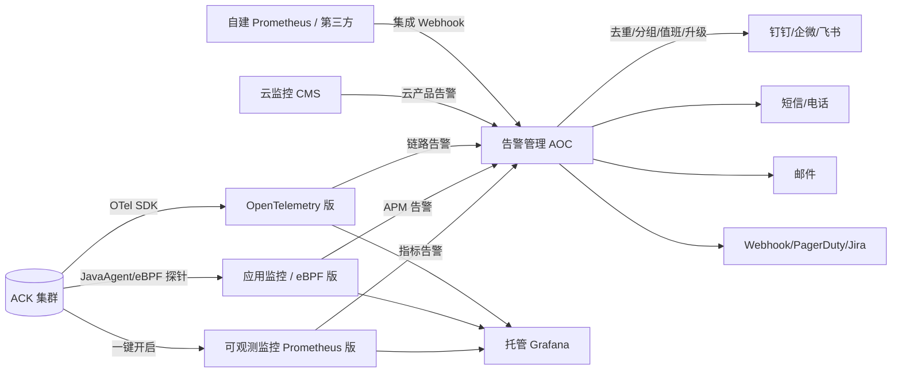

# 07-阿里云 ARMS 方案调研

> 文档定位：在自建 K8s 监控方案（`01`~`06`）已落地的基础上，
> 深度调研阿里云上部署的 K8s 集群基于 **ARMS（应用实时监控服务）** 平台
> 如何配置实时监控告警，作为"上云 / 托管"路径的对照方案。
>
> 调研日期：2026-07-06
> 适用场景：阿里云 ACK（容器服务 for Kubernetes）集群，使用 ARMS 托管监控告警。
> 标注说明：`[官方]`=阿里云官方文档；`[社区]`=第三方博客/社区；`[单源 ⚠️]`=仅一处来源未交叉验证；`[冲突 ⚠️]`=多源说法不一致。

---

## 0. TL;DR（先看结论）

1. **ARMS 不是单一产品，而是一个可观测产品族**：核心是三块——
   **可观测监控 Prometheus 版**（指标）、**应用监控**（APM + 链路；eBPF 版已公告下线，见 §1.1）、
   **告警管理（Alarm Operation Center, AOC）**（告警收敛 + 通知 + 值班）。
   三者可独立开通，也可组合成全栈。[官方]

2. **ACK 集群接入 ARMS 是"一键式"**：在 ACK 控制台对集群开启
   "Prometheus 监控"和"应用监控"开关，自动安装 `ack-arms-prometheus`
   / `ack-arms-cmonitor` 等组件，无需自建 Prometheus。[官方]

3. **告警管理 = 托管 Alertmanager + OnCall-lite**：ARMS 告警管理内置
   去重、分组、抑制、静默、值班排班、升级、多渠道（钉钉/短信/电话/邮件/Webhook），
   概念上与开源 Alertmanager + Grafana OnCall 对齐，省去自维护 Alertmanager/OnCall 的运维。[官方]

4. **与你现有自建方案的关系**：ARMS 是"把 Prometheus + Alertmanager + Grafana + 值班系统
   全部托管到阿里云"的路径；自建方案是"把同一套技术栈跑在自己集群里"。
   两者**技术内核高度同源**（都是 PromQL + Alertmanager 模型），主要差异在
   **运维成本 / 可控性 / 计费 / 数据归属**。[基于05]

5. **可以混合**：自建 Prometheus 可通过 **Remote Write** 把数据投递到 ARMS Prometheus；
   反之 ARMS Prometheus 也可投递到自建实例；告警也可走 ARMS 告警管理的
   "自建 Prometheus 集成"。两条路不互斥。[官方]

---

## 1. ARMS 产品全景：监控告警相关三件套

### 1.1 产品拆解

| 子产品 | 对标开源 | 核心能力 | 计费维度 |
|---|---|---|---|
| **可观测监控 Prometheus 版**（原 ARMS Prometheus） | Prometheus + 部分 kube-prometheus-stack | 托管 Prometheus 采集、存储、查询、Grafana 大盘、PromQL 告警规则 | 按写入数据量（基础指标免费；热存储已含，详见 §6.2）[官方] |
| **应用监控**（Java/Go/Python 等 APM） | SkyWalking / Jaeger + APM | JVM/Go runtime、调用链、慢调用、异常分析；通过 JavaAgent / 探针接入 | 按写入数据量 [官方] |
| **应用监控 eBPF 版**⚠️产品变更 | 无直接对标（无侵入 APM） | 基于 eBPF，无侵入采集多语言网络/调用/性能数据，Pod 级拓扑 | 按写入数据量；**已公告停止公测并下线，能力迁至云监控 2.0 应用监控模块** [官方] |
| **告警管理（AOC）** | Alertmanager + Grafana OnCall + 夜莺告警中心 | 告警集成、去重/分组/抑制/静默、值班排班、升级、多渠道通知 | 按通知次数（短信/电话）[官方] |
| **可观测可视化 Grafana 版** | Grafana | 托管 Grafana 工作区，原生数据源直连 ARMS | 按工作区实例（最低 9.9 元/月起）[官方] |
| **可观测链路 OpenTelemetry 版** | OpenTelemetry Collector + Jaeger | 非 Java/Go 语言链路追踪，与 ARMS 应用监控互补 | 按写入数据量 [官方] |

> ⚠️ 产品边界变化：自 2024 年起，**Prometheus 版、应用监控等"可观测监控"子产品
> 已整合进云监控（CMS）2.0 控制台**，可在云监控控制台或 ARMS 控制台双向操作；
> 但**告警管理（AOC）仍在 ARMS 下**。落地时以控制台实际入口为准。[官方]（云监控 2.0 = 融合 CMS+SLS+ARMS 的一站式平台，官方多源确认，原 [单源⚠️] 已撤销）

### 1.2 三件套之间的关系



---

## 2. ACK 集群接入 ARMS：一键开启路径

### 2.1 接入前提

- 集群类型：ACK 托管版 / 专有版 / Serverless（ASK）/ 注册集群（多云）均支持。[官方]
- `ack-arms-cmonitor` 组件**仅支持 ECS 类型节点**，**不支持 ECI**（ASK 上的 Pod）。
  Serverless / ECI 场景需用 `ack-arms-prometheus` + 应用监控替代节点级采集。[官方]（官方原文：ack-arms-cmonitor 仅适用于 ACK 的 ECS 类型节点，**无法监控 ECI 上的容器**；此项已无冲突，见 §8 结案）

### 2.2 开启 Prometheus 监控（指标层）

**路径**（控制台版本相关，以实际为准；下文控制台路径同理）：ACK 控制台 → 目标集群 → 左侧"运维管理"→ **Prometheus 监控** 页签 → 一键开启。[官方]

开启后系统自动：
1. 安装 `ack-arms-prometheus` 组件（ACK 对接托管 Prometheus 的官方采集器）；
2. 在 ARMS / 云监控侧创建一个 Prometheus 实例；
3. 注入预置采集规则（kubelet、kube-state-metrics、节点、容器、控制面指标——API Server 通用，etcd/Scheduler 仅 ACK 专有版可采）；
4. 自动关联预置 Grafana 大盘（集群总览、节点、Pod、API Server 等；etcd/Scheduler 大盘仅 ACK 专有版可采）。

> 预置采集覆盖范围：**控制面 + 节点 + 应用指标**全面采集，等价于自建方案里
> node-exporter + kube-state-metrics + kube-prometheus-stack 默认大盘的组合。[官方]

### 2.3 开启应用监控（APM 层，可选）

**路径**：ACK 控制台 → 目标集群 → **应用管理 → 接入管理** → 选择 Java/Go/Python 应用 → 一键接入。[官方]

接入方式分两种：

| 方式 | 适用 | 原理 | 侵入性 |
|---|---|---|---|
| **JavaAgent 注入**（ARMS JavaAgent 4.x，基于 OpenTelemetry） | Java 应用 | 通过 admission webhook 自动挂载 agent，JVM 启动时加载 | 零代码改动 |
| **eBPF 版**⚠️ | 限定语言（Go/Java/Python/Node.js/.NET 等） | DaemonSet 部署 eBPF 探针，内核态抓取网络/调用 | 零代码，但**非"零语言限制"**（有明确语言覆盖） |

> **建议**：Java 优先用 ARMS 应用监控（JavaAgent 4.x）；其它语言用 OpenTelemetry 版补全。⚠️ **应用监控 eBPF 版已公告停止公测并下线**，无侵入多语言 APM 能力迁至云监控 2.0 应用监控模块，新接入不建议再选 eBPF 版（以官方公告为准）。[官方]

### 2.4 组件清单（接入后集群内会装的 Pod）

| 组件 | DaemonSet/Deploy | 作用 |
|---|---|---|
| `ack-arms-prometheus` | Deploy | 托管 Prometheus 的本地采集器，远程写到 ARMS |
| `ack-arms-cmonitor` | DaemonSet | ECS 节点级容器监控（不支持 ECI） |
| `arms-*` 相关容器（命名以控制台为准） | DS | 节点指标、cAdvisor 增强 |
| `arms-pilot` / `arms-bootstrap` | DS | 应用监控 JavaAgent 注入与生命周期 |

> 注：ARMS 走的是"集群内轻量 agent + 云端托管存储/查询"模型，**不占用集群 TSDB 存储**（不像自建 Prometheus 会吃本地盘；agent 仍占少量 CPU/内存）。[官方]
> 这是托管方案相对自建的一个运营优势（编辑判断，非官方原文）。

---

## 3. 告警规则配置：从指标到告警事件

### 3.1 两套告警规则引擎（容易混淆）

ARMS 体系里存在**两套并行的告警规则**，理解边界是配置的前提：

| 引擎 | 在哪配 | 表达式 | 输出去向 |
|---|---|---|---|
| **Prometheus 告警规则**（基于 PromQL） | Prometheus 实例的"告警规则"页 | PromQL + 阈值 + for 持续时间 | 触发后**自动发到 ARMS 告警管理** |
| **Grafana 原生告警规则**（可选） | 托管 Grafana 的 Alerting | PromQL / 多数据源 | 走 Grafana 自己的通知策略，可独立于 AOC |

> 实务建议：**统一用 Prometheus 告警规则 + AOC 收敛**，避免两套通知策略打架。
> Grafana 原生告警只在需要跨数据源（指标+日志+SQL）复合条件时用。[官方]

### 3.2 创建一条 Prometheus 告警规则（标准流程）

**路径**：ARMS 控制台 → Prometheus 监控 → 选实例 → **告警规则 → 创建告警规则**。[官方]

字段说明：

| 字段 | 说明 | 示例 |
|---|---|---|
| 告警指标 | 预置指标下拉 | 容器 CPU 使用率 |
| 触发条件 | 阈值 + 比较 | 大于 80% |
| 筛选维度 | namespace / pod / label | namespace = prod |
| 持续时间 | 等价 PromQL 的 `for` | 持续 1 分钟 |
| PromQL（高级） | 直接写表达式 | `sum by(pod)(rate(container_cpu_usage_seconds_total{namespace="prod"}[2m])) > 0.8` |
| 通知策略 | 关联 AOC 通知策略 | 见 §4 |
| 告警级别 | 默认 / P4 / P3 / P2 / P1（P1 最高） | 影响 §4 的通知方式；severity 标签（critical/warning 等）映射到 P 级 |

### 3.3 告警规则模板（跨实例批量管理）

- 支持**告警规则模板**：跨地域、跨 Prometheus 实例统一管理告警规则；
- 新增实例时一键应用模板，避免逐实例手工配置；
- 概念上等价于自建方案里把 `PrometheusRule` CR 用 GitOps 批量下发。[官方]

### 3.4 与自建方案规则互译

| 自建方案（PrometheusRule CR） | ARMS 等价物 |
|---|---|
| `alert` / `expr` / `for` | 告警规则表单或 PromQL 模式 |
| `labels.severity` | 告警级别 |
| `annotations.summary` | 规则描述 |
| Alertmanager `route.group_by` | AOC 通知策略的"分组" |
| Alertmanager `route.receiver` | AOC 通知策略的"通知对象" |
| Alertmanager `inhibit_rules` | AOC 的"抑制/屏蔽"策略 |

> **结论**：规则语义可 1:1 互译，迁移成本主要在"把 YAML 改成表单/模板录入"，
> 而不是重写规则逻辑。[基于05][官方]

---

## 4. ARMS 告警管理（AOC）：告警收敛与通知

> 这是 ARMS 体系里**最贴近你项目"告警治理 + 钉钉触达"目标**的模块，
> 也是托管方案相对自建 Alertmanager + PrometheusAlert 最大的增量价值。

### 4.1 AOC 的核心模型

AOC 采用 **事件 → 告警 → 通知** 三级模型，与开源 Alertmanager 略有差异：

```
告警源(Prom/云监控/自建/第三方)
   │  告警事件(Event)
   ▼
AOC 集成(Integration) ── 按 integration 去重
   │
   ▼
通知策略(Notification Policy) ── 匹配 + 分组 + 压缩
   │  生成告警(Alert)，状态: Firing/Acknowledged/Resolved
   ▼
通知对象(Contact/Group/排班) + 通知方式(钉钉/短信/电话/邮件/Webhook)
   │
   ├─ 未确认 → 升级策略(Escalation) → 通知下一级
   └─ 确认/关闭 → 结束
```

### 4.2 告警集成（Integration）：把告警源接进来

AOC 支持的集成类型（在 `告警管理 → 集成` 页配置）：[官方]

| 集成类型 | 用途 |
|---|---|
| **Prometheus**（内置，ACK 开启后自动） | 接 ARMS Prometheus 触发的告警 |
| **自建 Prometheus** | 把开源 Prometheus 的 firing alert 通过 Webhook 推给 AOC |
| **云监控 CMS** | 接 ECS/RDS/SLB 等云产品告警 |
| **自定义集成** | 任意第三方系统通过 Webhook + 自定义字段映射接入 |
| **Zabbix / Nagios / Open-Falcon 等** | 预置集成模板（完整列表以控制台"集成"页为准；SLS / Grafana 另有原生集成）[官方] |
| **PagerDuty / Jira / 飞书 / 企微** | 不只接告警，也可双向处理 |

> **关键能力**：集成层可配置**告警恢复字段**（如 `status == ok` 判定为 resolved），
> 解决非 Prometheus 源没有"恢复事件"的问题。[官方]

### 4.3 通知策略（Notification Policy）：收敛的核心

每个通知策略包含：[官方]

| 配置项 | 作用 | 对标开源 |
|---|---|---|
| 匹配规则 | 按告警字段（severity/namespace/alertname 等）匹配 | Alertmanager `route.matchers` |
| 分组(group_by) | 按字段分组生成一条告警 | Alertmanager `group_by` |
| 压缩/合并 | 时间窗口内同类事件压缩 | Alertmanager `group_wait/group_interval` |
| 屏蔽/抑制(Silence) | 匹配规则的告警临时不通知 | Alertmanager `silence` / `inhibit_rules` |
| 通知方式 | 钉钉/短信/电话/邮件/Webhook | Alertmanager `receiver` |
| 通知时段 | 工作时间 / 7×24 | Alertmanager 原生 `time_intervals`（v0.22+）；AOC 为 UI 配置 |
| 重复通知间隔 | 避免 repeat_interval 过短刷屏 | Alertmanager `repeat_interval` |

### 4.4 值班排班（Scheduling）：内置 OnCall

**路径**：`告警管理 → 通知对象 → 排班管理 → 新建排班`。[官方]

支持：
- 班次（班次 1 / 班次 2）、轮班周期（日/周/自定义）；
- 通知策略关联排班，告警自动发给**当前值班人**；
- 升级策略：当前值班人 N 分钟未确认 → 通知下一级 / 电话强提醒。

> 这正是你在 `05-决策汇总.md §2` 里希望但开源 Alertmanager 不内置的能力，
> 也是 Grafana OnCall OSS 的核心卖点——AOC 把它托管化了。[基于05][官方]

### 4.5 多渠道通知：钉钉是第一公民

AOC 原生支持的通知渠道：[官方]

| 渠道 | 特点 | 备注 |
|---|---|---|
| **钉钉群机器人** | 在 AOC 创建钉钉机器人 → 通知策略指定群 | 与你自建方案目标完全一致 |
| **钉钉工作通知** | 点对点推送，可达性更高 | 适合 P0 |
| **短信** | 每账号每天免费 15 条（未开通告警管理按量时） | 超出**停发**（未开通时）；开通按量后 0.05 元/次 |
| **电话** | 每账号每天免费 3 通（同上） | 超出**停发**（未开通时）；开通按量后 0.15 元/次 |
| **邮件** | 免费兜底 | 同 Alertmanager |
| **Webhook** | 任意自定义 | 可转 PrometheusAlert |
| **企微 / 飞书 / PagerDuty / Jira** | 双向集成 | 跨协作平台 |

> 对比自建方案：你原本要 Alertmanager → `prometheus-webhook-dingtalk` → 钉钉，
> 短信还要自研 SDK。AOC 把这些全打包了，但代价是按通知次数计费（见 §6）。

---

## 5. 多集群 / 跨账号统一告警

你当前是 1 集群，但如果未来 ACK 集群扩展到多个，或多云混合，AOC 有现成方案：

### 5.1 多 Prometheus 实例统一告警

- 每个 ACK 集群开启 Prometheus 后，会在 ARMS 侧生成独立 Prometheus 实例；
- 告警规则模板可跨实例批量下发；
- 所有实例的告警事件**默认进同一个 AOC**（账号级），天然多集群统一视图。[官方]

### 5.2 跨账号告警汇聚

**场景**：生产 / 测试 / 不同业务线分属不同阿里云账号。

**方案**：通过 AOC 的**告警转发 / 跨账号集成**，把多账号告警汇到一个中心账号的 AOC 处理。[官方]

操作路径：
1. 中心账号在 AOC 创建"云监控跨账号集成"或自定义集成，拿到 Webhook；
2. 各成员账号把 ARMS 告警事件转发到该 Webhook；
3. 中心账号统一值班、统一通知策略。

> 对标自建方案：等价于"每集群 Prometheus remote_write 到中心 VictoriaMetrics，
> 中心 vmalert + Alertmanager 收敛"。托管方案省掉了中心存储和规则引擎的运维。[基于05][官方]

---

## 6. 计费模型（重点：影响决策的关键）

### 6.1 计费总览（2023-12-08 起新版计费）

ARMS 新版计费分两大类：[官方]

| 计费类 | 计费项 | 说明 |
|---|---|---|
| **按写入可观测数据量** | Prometheus 版 / 应用监控 / OpenTelemetry | 按每日写入的指标/链路数据量计费 |
| **按可观测功能** | 告警管理 / Grafana 工作区 | 按功能实例或通知次数计费 |

计费周期：**1 天**，次日 00:00 结算前一天。[官方]

### 6.2 免费额度与写入单价（账号级共享，不跨地域）

> ⚠️ 本节经 2026-07-06 多源交叉验证订正：原文曾把 Prometheus 版「按写入量」与
> 「按上报量」两套计费口径的存储规则混淆，并把 0.4 元/GB 误标为应用监控单价。下方已拆分。[官方]

| 子产品 | 免费额度 | 超额单价（中国内地公有云） | 备注 |
|---|---|---|---|
| **Prometheus 版**（自定义指标写入） | 每月 **50 GB** 免费；**基础指标写入免费** | 标准版 **0.4 元/GB**（含 90 天免费热存储）；旗舰版 **0.6 元/GB**（含 180 天） | 免费额度账号级、跨实例共享、**不跨地域**；2026-01-05 调整**不影响**此项 |
| **应用监控** | 指标 **25 GB** + 链路 **25 GB**/月（**分项独立、不可互转**） | 指标写入按量计费（单价以应用监控计费页为准） | ⚠️ 不要和 Prometheus 的 50 GB 混用；2026-01-05 起由"合并 50GB"改为分项 |
| **指标存储**（Prometheus 版） | 按写入量：标准版 90 天 / 旗舰版 180 天免费热存储（**已含在写入单价内，不另收**） | 归档存储（可选层）：0.001 元/GB/天 | 按写入量"不支持扩展热存储时长"；超期另收仅见于按上报量旧口径，见下表 |
| **告警管理（未开通按量时）** | 每天 **15 条短信 + 3 通电话** | 开通按量后：短信 **0.05 元/次**、电话 **0.15 元/次**（超每日免费额度部分） | 未开通时超出后**该渠道停止发送**（不是计费，是停发！）；邮件/Webhook/钉钉/企微免费无限制 |
| **Grafana 工作区** | 无免费（另提供免费共享版工作区） | 开发者版最低 **9.9 元/月**/独享工作区（专家版 240 起） | 包年包月 |

> 💡 **基础指标 vs 自定义指标（影响成本的关键，已核实）**：基础指标写入免费，官方"容器集群基础指标"清单覆盖 `node_*`（node-exporter）/ `kube_*`（kube-state-metrics）/ `container_*`（cAdvisor）/ kubelet / CoreDNS / CSI / GPU-Exporter 等——基础设施监控主流指标族均在内，仅清单外的自定义/应用指标占 50GB/月额度。⚠️ 基础指标免费仅适用于 ACK 等阿里云容器服务集群。[官方]

> ⚠️ **Prometheus 版两套计费口径的存储规则不同（订正重点）**：
>
> | 计费口径 | 写入单价 | 免费热存储 | 超期处理 |
> |---|---|---|---|
> | **按写入量**（主路径，元/GB） | 标准版 0.4 / 旗舰版 0.6 | **90 / 180 天，已含在单价内，不另收费** | 不支持延长；可启用归档存储 0.001 元/GB/天 |
> | **按上报量**（旧口径，元/百万条） | 0.8 → 0.25 累进 | **仅 30 天** | 超期 **0.01 元/百万条/天** |
>
> 结论：**"超过 30 天的存储另收费"只对"按上报量"旧口径成立**；主路径"按写入量"在 90/180 天内不另收存储费。[官方]

### 6.3 ⚠️ 关键计费变更（生效中）

| 生效时间 | 变更 | 影响 |
|---|---|---|
| **2026-01-05 00:00 起**（公告 2025-11-26 发布） | ARMS 应用监控 / OpenTelemetry 版**免费额度调整** | 由「指标+链路**合并** 50 GB/月」→「**分项独立**：指标 25 GB + 链路 25 GB/月」。⚠️ **不影响 Prometheus 版**自定义指标 50 GB 免费额度 |
| **2024-03-31 起** | ARMS **基础版停止提供技术支持**（含应用监控 / 前端监控基础版），且不支持新开通 | 老实例需切换到「按写入可观测数据量计费」模式（官方精确措辞为"停止技术支持 + 不支持开通"，非"下线"） |
| 长期 | **指标存储**：仅「按上报量」旧口径在 30 天免费热存储后另收 0.01 元/百万条/天 | 主路径「按写入量」90/180 天内**不另收**；长保留需启用归档存储 0.001 元/GB/天（见 §6.2 口径拆分） |

> ✅ 短信/电话**精确单价已有官方明码**（原"未给死数字"的说法已过时，见 §8-A 结案）：
> - **自建路径**（独立阿里云短信服务）：验证码/通知短信 **0.045 元/条起**（≤10 万条档，累进至 0.038），推广短信 0.055 元/条起；
> - **托管路径**（ARMS 告警管理按量）：短信 **0.05 元/次**、电话 **0.15 元/次**。
> 社区传「~0.1 元/条」偏高失准（官方仅其一半），**不要采用**。[官方]

### 6.4 与自建方案的成本对照（你当前 28 节点场景）

| 成本项 | 自建方案（现状） | ARMS 托管方案 |
|---|---|---|
| 指标采集/存储 | 复用集群本地盘，~0 现金 | 50GB/月内免费；超量按 GB 计费 |
| Grafana | 自建（kube-prometheus-stack 自带） | 9.9 元/月起 / 工作区 |
| Alertmanager / 通知网关 | 自建 + prometheus-webhook-dingtalk | 告警管理免费（通知按次） |
| 短信 | 阿里云短信 ~0.045 元/条起（你已选，验证码/通知短信档） | ARMS 告警管理按量：短信 0.05 元/次、电话 0.15 元/次（超每日免费额度） |
| 值班排班 / OnCall | 自研或 Grafana OnCall OSS（状态不稳） | **AOC 内置**（省自研排班/升级） |
| 运维人力 | 需维护 Prometheus/AM/Grafana 升级、保留、容量 | 全托管（省监控栈运维，非零：仍有配额/成本管理） |
| 数据归属 | 自有，可离线 | 阿里云侧，迁移需 Remote Write 导出 |

> **结论（2026-07-06 订正）**：原文"自建略低"**方向保留**，但理由需修正。
> 经核实（官方"容器集群基础指标"清单），`node_*`（node-exporter）/ `kube_*`（kube-state-metrics）/ `container_*`（cAdvisor）/ kubelet / CoreDNS / CSI / GPU-Exporter 等**基础设施指标族均在"基础指标"免费清单内**——你 28 节点的基础设施监控在 ARMS 侧**指标费 ≈ 0**，与自建（本地盘）在指标层打平；50GB/月额度只对清单外的自定义/应用指标有意义。
> 故 ARMS 真实硬成本 = **Grafana 9.9 元/月起 + 告警通知按次**；自建仍略低，主要省在 **Grafana 自带（kube-prometheus-stack）+ 短信单价更低（0.045 vs 0.05）**，而非指标量。
> ⚠️ 边界：基础指标免费**仅适用于 ACK/ACS/ASK/ACK One/ACK Edge 等阿里云容器服务集群**；清单于 2024-11-12 调整过，以官方页为准。[基于06][官方]

**月度现金成本粗算（28 节点，场景估算）**

> 前提：指标费双方均 ≈ 0（自建本地盘 / ARMS 基础指标免费，见 §6.2）；差异在 Grafana + 通知。告警频次未知，按三档场景估：

| 场景（短信/月） | 自建（Grafana 自带 0 + 短信 0.045/条，无免费额度） | ARMS（Grafana 9.9/月 + 通知，含 15 条/天免费） | 月差额 |
|---|---|---|---|
| 低 ~30 | ≈ 1.4 元 | ≈ 9.9 元 | ARMS 贵 ~8.5 |
| 中 ~200 | ≈ 9 元 | ≈ 9.9 元 | ARMS 贵 ~0.9 |
| 高 ~500 | ≈ 22.5 元 | ≈ 12.4 元¹ | ARMS 反便宜 ~10 |

¹ 高量需开通告警管理按量；未开通则每日超 15 条后**停发**（见 §6.2），非计费。

> **转折点**：短信量 > ~**220 条/月**时，自建短信费（0.045×N）超过 ARMS Grafana 固定费（9.9），ARMS 因通知含免费额度而更便宜。
> ⚠️ 变量：ARMS 另有**免费共享版 Grafana**（功能/配额受限）；若用它替代 9.9 元独享版，ARMS 低/中量场景也 ≈ 0 元——但生产建议独享版。
> ⚠️ 未计非现金项：自建运维人力（升级/容量/保留）、ARMS 数据归属/离线缺失，见 §7.1。

---

## 7. 自建 vs ARMS：决策矩阵

> 对齐 `05-决策汇总.md` 的产品形态目标和 `06-实际部署决策.md` 的场景约束。

### 7.1 能力对照

| 维度 | 自建（你当前路线） | ARMS 托管 | 胜出 |
|---|---|---|---|
| 指标采集 | node-exporter + KSM + Prometheus | ack-arms-prometheus（同源） | 平 |
| 指标存储 | 本地 TSDB（30 天 ~30-45GB） | 托管；基础指标免费（node/kube/container/kubelet 均覆盖），仅自定义指标占 50GB/月 | 小规模平，大规模 ARMS |
| PromQL/告警规则 | PrometheusRule CR（GitOps） | 控制台表单 + 模板 | 自建可控性强 |
| 告警收敛 | Alertmanager（route/group/inhibit） | AOC（同模型 + UI） | 平 |
| 值班排班 | 自研或 Grafana OnCall OSS | **AOC 内置** | **ARMS** |
| 多渠道通知 | prometheus-webhook-dingtalk + 自研短信 | **钉钉/短信/电话/邮件全内置** | **ARMS** |
| APM / 链路追踪 | 二期仅规划 Loki（**日志**，非 tracing）；tracing 未落地 | 应用监控 + OTel 全栈（eBPF 版已公告下线） | **ARMS** |
| 多集群统一 | VictoriaMetrics（你已判 overkill） | 天然多实例统一 | **ARMS** |
| 数据归属/可控 | **自有** | 阿里云侧 | **自建** |
| 合规/离线 | **可全离线** | 必须公网/阿里云 | **自建** |
| 运维成本 | 需维护升级/容量/保留 | **省监控栈运维**（非零） | **ARMS** |
| 现金成本（28 节点） | ~0（复用集群）+ 短信 | Grafana 9.9/月起 + 通知按次（指标费≈0：基础指标免费） | 自建略低 |

### 7.2 三种落地路径建议

| 路径 | 适用 | 取舍 |
|---|---|---|
| **A. 纯自建**（你当前） | 离线/合规要求高、团队有 Prometheus 经验、控成本 | 放弃 APM 和托管值班 |
| **B. 纯 ARMS 托管** | 全阿里云栈、想省监控栈运维、可接受数据上云 | 放弃数据归属和离线能力 |
| **C. 混合（推荐评估）** | 自建 Prometheus 作主，ARMS 补 APM/值班 | 见 §9 |

---

## 8. 冲突 / 待核实信息

| 事实点 | 双方说法 | 取舍 |
|---|---|---|
| `ack-arms-cmonitor` 是否支持 ECI | ✅ **已结案**：官方明确仅适用于 ECS 节点、**无法监控 ECI** | Serverless/ECI 场景用 `ack-arms-prometheus` + 应用监控替代 |
| **§8-A** 短信/电话精确单价 | ✅ **已结案**：官方有明码定价 | 自建路径（独立短信服务）验证码/通知短信 **0.045 元/条起**（累进至 0.038）、推广短信 0.055 元/条起；托管路径（ARMS 告警管理按量）短信 **0.05 元/次**、电话 **0.15 元/次**。社区传 ~0.1 元/条**偏高失准**（官方仅一半），不采用。[官方] |
| Prometheus 版归口 | ✅ **已结案**：官方确认云监控 2.0 融合 CMS+SLS+ARMS，Prometheus 版整合其中 | 控制台入口云监控/ARMS 两处都在 |
| 免费额度数值 | 50GB/月、15 短信+3 电话/天 多源一致 | 双路 ✅，可采信 |
| **§8-B** 2026 免费额度调整具体数值 | ✅ **已结案（单源，建议二次确认）**：公告原文已查到 | 应用监控/OpenTelemetry 由「指标+链路**合并** 50 GB/月」→「**分项独立**：指标 25 GB + 链路 25 GB/月」，**不影响 Prometheus 50 GB**；公告 2025-11-26 发布、2026-01-05 00:00 生效。[官方][单源 ⚠️] |
| **§8-C** 基础指标覆盖范围（node/KSM 等） | ✅ **已结案**：官方"容器集群基础指标"清单已查 | `node_*`/`kube_*`/`container_*`/kubelet/CoreDNS/CSI/GPU-Exporter 等**均在基础指标免费清单内**，仅清单外为自定义指标；免费仅适用 ACK 等阿里云容器服务集群，清单 2024-11-12 调整过。[官方] |

> 📌 **价格时效性**：以上计费数字均基于 2026-07-06 抓取的阿里云官方文档快照，官方文档多处标注"价格请以产品购买页面为准"。采购前**必须**以控制台定价页二次确认；中国香港/海外（如 Prometheus 0.56 元/GB）、金融云（0.76 元/GB）、政务云单价均高于中国内地公有云。

---

## 9. 与本项目自建方案的衔接建议

基于 `06-实际部署决策.md`（28 节点单集群）和你"还深度调研 ARMS"的诉求：

### 9.1 短期（不影响当前自建落地）
- 当前自建方案继续推进，ARMS 调研作为**对照与备选**存档；
- **不需要**为 ARMS 改动现有 `kube-prometheus-stack.values.yaml` 等部署文件。

### 9.2 中期可评估的混合点（低成本增量）

| 增量 | 做法 | 价值 |
|---|---|---|
| **APM 补全** | 在 ACK 集群额外开启 ARMS 应用监控（不动自建 Prometheus） | 拿到 JVM/链路/慢调用，自建方案二期才做 |
| **值班排班外包** | 把 Alertmanager webhook 转发到 AOC（用"自建 Prometheus 集成"） | 借 AOC 的排班/升级/电话，省自研 |
| **Remote Write 双写** | 自建 Prometheus remote_write 一份到 ARMS Prometheus | 既能本地保留，又有托管大盘兜底 |

### 9.3 长期触发切换的信号

当出现以下任一情况，建议重新评估是否整体迁到 ARMS 托管：
1. 集群从 1 个扩展到 3+，多集群统一视图需求真实出现；
2. 自建 Prometheus/Alertmanager 的版本升级、保留容量成为运维负担；
3. 业务方强烈要求 APM / 全链路（自建 Loki/Jaeger 成本高于 ARMS 溢价）；
4. 合规允许数据上云，且团队希望砍掉监控栈运维人力。

---

## 10. 参考文档清单

### 官方（阿里云帮助中心）
- [ack-arms-prometheus 组件介绍](https://help.aliyun.com/zh/ack/product-overview/ack-arms-prometheus)
- [ack-arms-cmonitor 组件介绍](https://www.alibabacloud.com/help/zh/ack/product-overview/ack-arms-cmonitor)
- [接入阿里云 Prometheus 监控（ACK）](https://www.alibabacloud.com/help/zh/ack/serverless-kubernetes/user-guide/use-managed-service-for-prometheus-to-monitor-an-ack-cluster)
- [容器场景可观测最佳实践](https://help.aliyun.com/zh/ack/ack-managed-and-ack-dedicated/user-guide/observability-best-practices)
- [创建 Prometheus 告警规则](https://help.aliyun.com/zh/arms/prometheus-monitoring/create-an-alert-rule-for-a-prometheus-instance)
- [集成自建 Prometheus 告警](https://help.aliyun.com/zh/arms/alarm-operation-center/integrate-self-managed-prometheus-instances-with-arms)
- [ARMS 告警管理概述](https://www.alibabacloud.com/help/zh/arms/alarm-operation-center/product-overview/alarm-management-overview)
- [通知策略最佳实践](https://help.aliyun.com/zh/arms/alarm-operation-center/best-practices-for-notification-policies)
- [创建排班策略](https://help.aliyun.com/zh/arms/alarm-operation-center/create-scheduling-policies)
- [钉钉机器人接入](https://help.aliyun.com/zh/arms/alarm-operation-center/dingtalk-chatbots)
- [静默策略](https://help.aliyun.com/zh/arms/alarm-operation-center/silence-policies)
- [统一告警管理最佳实践](https://help.aliyun.com/zh/arms/alarm-operation-center/best-practice-of-centralized-alert-management)
- [多账号告警转发](https://help.aliyun.com/zh/arms/alarm-operation-center/forward-alerts-from-multiple-accounts-to-one-account)
- [自定义集成](https://www.alibabacloud.com/help/zh/arms/alarm-operation-center/integrate-custom-alert-sources-with-arms)
- [产品计费（新版）](https://help.aliyun.com/zh/arms/product-overview/product-billing-new-version)
- [告警管理计费说明](https://help.aliyun.com/zh/arms/alarm-operation-center/product-overview/billing-description)
- [ARMS 应用监控与 OpenTelemetry 版免费额度调整公告（2026-01-05 生效）](https://help.aliyun.com/zh/arms/product-overview/changes-to-the-free-quotas-of-arms-application-monitoring-and-managed-service-for-opentelemetry)
- [Remote Write 投递到自建 Prometheus](https://help.aliyun.com/zh/arms/prometheus-monitoring/posting-prometheus-data-to-other-prometheus-instances)
- [自建 Prometheus 迁移到阿里云托管 Prometheus](https://help.aliyun.com/zh/prometheus/use-cases/migrate-self-built-open-source-prometheus-to-alibaba-cloud-managed-prometheus-service)
- [ARMS 应用监控 eBPF 版](https://www.aliyun.com/activity/middleware/container-monitoring)
- [ARMS 与 OpenTelemetry 区别](https://www.alibabacloud.com/help/zh/arms/application-monitoring/product-overview/differences-between-arms-and-opentelemetry)
- [配置 Grafana 原生告警](https://www.alibabacloud.com/help/zh/arms/observable-visualization-grafana-edition/configure-grafana-native-alarm)

### 社区参考
- [ARMS 应用监控 eBPF 版深度介绍（博客园）](https://www.cnblogs.com/alisystemsoftware/p/17931706.html)
- [ARMS 中告警管理和 Alertmanager 的关系](https://developer.aliyun.com/ask/638075)
- [自建 Prometheus 迁移阿里云解读（掘金）](https://juejin.cn/post/7395863831299833906)
- [观测云 vs 阿里云 ARMS 3.0（第三方对比）](https://docs.guance.com/best-practices/insight/guance-arms/)
